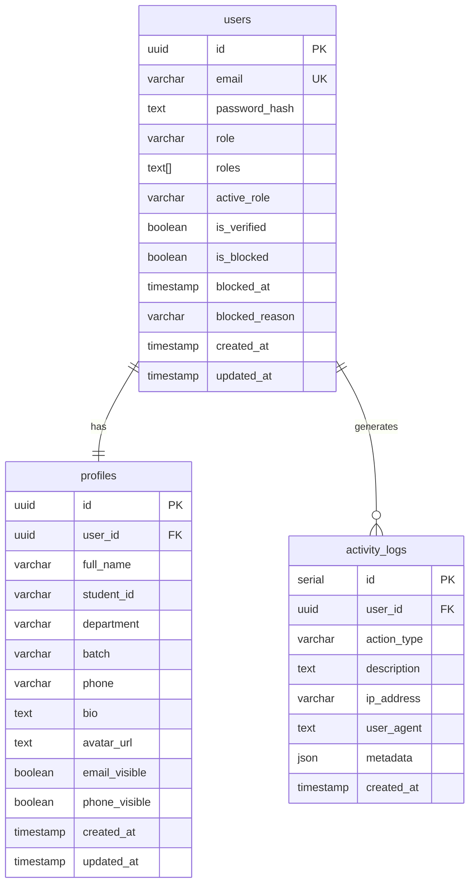
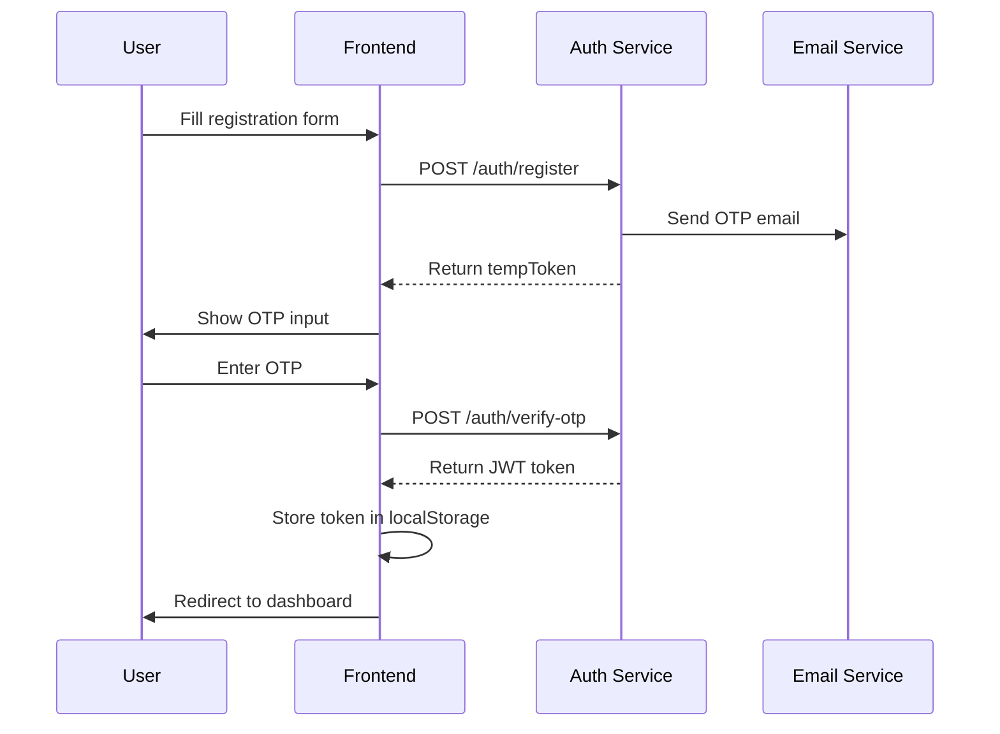

# Auth Service API

<span class="port-indicator">Port 3001</span> <span class="db-tag">auth_db</span>

The Auth service handles all authentication, user management, and profile operations with OTP-based verification.

---

## Overview

| Property | Value |
|----------|-------|
| **Port** | 3001 |
| **Database** | `auth_db` |
| **Base Path** | `/api/auth` |
| **JWT Secret** | Environment variable |
| **OTP Secret** | Environment variable |
| **Token Expiry** | 7 days |

## Database Schema

### Tables



---

## API Endpoints

### Authentication

#### Register User

<span class="api-method method-post">POST</span> `/auth/register`

Initiates registration with OTP verification.

=== "Request"

    ```json
    {
        "email": "student@uiu.edu",
        "password": "securePassword123",
        "fullName": "John Doe",
        "studentId": "011221001",
        "department": "CSE",
        "batch": "52"
    }
    ```

=== "Response"

    ```json
    {
        "success": true,
        "message": "OTP sent to email",
        "tempToken": "temporary-token-for-otp-verification"
    }
    ```

!!! note "Email Restriction"
    Only `@uiu.edu` email addresses are accepted for registration.

#### Verify OTP

<span class="api-method method-post">POST</span> `/auth/verify-otp`

Verifies the OTP sent to user's email.

=== "Request"

    ```json
    {
        "tempToken": "from-register-response",
        "otp": "123456"
    }
    ```

=== "Response"

    ```json
    {
        "success": true,
        "message": "Registration complete",
        "token": "jwt-token",
        "user": {
            "id": "uuid",
            "email": "student@uiu.edu",
            "name": "John Doe",
            "roles": ["STUDENT"],
            "activeRole": "STUDENT"
        }
    }
    ```

#### Login

<span class="api-method method-post">POST</span> `/auth/login`

Authenticates user and returns JWT token.

=== "Request"

    ```json
    {
        "email": "student@uiu.edu",
        "password": "securePassword123"
    }
    ```

=== "Response"

    ```json
    {
        "success": true,
        "message": "Login successful",
        "token": "eyJhbGciOiJIUzI1NiIs...",
        "user": {
            "id": "uuid",
            "email": "student@uiu.edu",
            "name": "John Doe",
            "department": "CSE",
            "batch": "52",
            "roles": ["STUDENT", "VENDOR"],
            "activeRole": "STUDENT"
        }
    }
    ```

!!! warning "Blocked Users"
    Blocked users will receive a 403 error with the block reason.

#### Resend OTP

<span class="api-method method-post">POST</span> `/auth/resend-otp`

Resends OTP for verification.

=== "Request"

    ```json
    {
        "tempToken": "from-register-response"
    }
    ```

---

### Password Reset

#### Request Reset

<span class="api-method method-post">POST</span> `/auth/forgot-password`

Initiates password reset with OTP.

=== "Request"

    ```json
    {
        "email": "student@uiu.edu"
    }
    ```

=== "Response"

    ```json
    {
        "success": true,
        "message": "Password reset OTP sent",
        "resetToken": "temporary-reset-token"
    }
    ```

#### Verify Reset OTP

<span class="api-method method-post">POST</span> `/auth/verify-reset-otp`

=== "Request"

    ```json
    {
        "resetToken": "from-forgot-password",
        "otp": "123456"
    }
    ```

#### Reset Password

<span class="api-method method-post">POST</span> `/auth/reset-password`

=== "Request"

    ```json
    {
        "resetToken": "verified-reset-token",
        "newPassword": "newSecurePassword123"
    }
    ```

---

### Profile Management

#### Get Own Profile

<span class="api-method method-get">GET</span> `/auth/profile`

!!! info "Authentication Required"

Returns the current user's complete profile.

=== "Response"

    ```json
    {
        "success": true,
        "user": {
            "id": "uuid",
            "email": "student@uiu.edu",
            "isVerified": true,
            "role": "STUDENT",
            "roles": ["STUDENT"],
            "activeRole": "STUDENT",
            "profile": {
                "fullName": "John Doe",
                "studentId": "011221001",
                "department": "CSE",
                "batch": "52",
                "phone": "+8801712345678",
                "bio": "CS student at UIU",
                "avatarUrl": "https://...",
                "emailVisible": true,
                "phoneVisible": false
            }
        }
    }
    ```

#### Get User Profile by ID

<span class="api-method method-get">GET</span> `/auth/users/:id`

Returns public profile information for a user.

=== "Response"

    ```json
    {
        "success": true,
        "user": {
            "id": "uuid",
            "name": "John Doe",
            "email": "student@uiu.edu",
            "department": "CSE",
            "batch": "52",
            "avatarUrl": "https://..."
        }
    }
    ```

!!! note "Privacy"
    Hidden fields (email, phone) are not returned based on user's privacy settings.

#### Update Profile

<span class="api-method method-put">PUT</span> `/auth/profile`

!!! info "Authentication Required"

=== "Request"

    ```json
    {
        "fullName": "John Smith",
        "phone": "+8801712345678",
        "bio": "Updated bio",
        "avatarUrl": "base64-encoded-image-or-url",
        "emailVisible": true,
        "phoneVisible": false
    }
    ```

=== "Response"

    ```json
    {
        "success": true,
        "message": "Profile updated successfully",
        "profile": { ... }
    }
    ```

---

### Role Management

#### Switch Active Role

<span class="api-method method-post">POST</span> `/auth/switch-role`

Switch between user's available roles.

=== "Request"

    ```json
    {
        "role": "VENDOR"
    }
    ```

=== "Response"

    ```json
    {
        "success": true,
        "message": "Role switched to VENDOR",
        "token": "new-jwt-with-updated-role",
        "activeRole": "VENDOR"
    }
    ```

!!! info "Available Roles"
    - `STUDENT` - Default role for all users
    - `VENDOR` - Marketplace seller
    - `ADMIN` - System administrator

---

### Admin Endpoints

#### Get All Users

<span class="api-method method-get">GET</span> `/auth/admin/users`

!!! warning "Admin Only"

Returns paginated list of all users.

**Query Parameters:**

| Parameter | Type | Description |
|-----------|------|-------------|
| `page` | number | Page number (default: 1) |
| `limit` | number | Results per page (default: 20) |
| `search` | string | Search by name/email |
| `role` | string | Filter by role |

#### Block User

<span class="api-method method-post">POST</span> `/auth/admin/users/:id/block`

=== "Request"

    ```json
    {
        "reason": "Violation of community guidelines"
    }
    ```

#### Unblock User

<span class="api-method method-post">POST</span> `/auth/admin/users/:id/unblock`

#### Add Role to User

<span class="api-method method-post">POST</span> `/auth/admin/users/:id/roles`

=== "Request"

    ```json
    {
        "role": "ADMIN"
    }
    ```

#### Get Activity Logs

<span class="api-method method-get">GET</span> `/auth/admin/activity-logs`

Returns system activity logs for audit purposes.

---

## JWT Token Structure

The JWT token payload contains:

```json
{
    "id": "user-uuid",
    "email": "student@uiu.edu",
    "name": "John Doe",
    "department": "CSE",
    "batch": "52",
    "roles": ["STUDENT", "VENDOR"],
    "activeRole": "STUDENT",
    "iat": 1705312800,
    "exp": 1705917600
}
```

---

## Authentication Flow



---

## Error Codes

| Code | Message | Description |
|------|---------|-------------|
| 400 | Invalid request | Missing/invalid fields |
| 401 | Invalid credentials | Wrong email/password |
| 401 | Invalid OTP | Wrong or expired OTP |
| 403 | Account blocked | User has been blocked |
| 403 | Not authorized | Insufficient permissions |
| 404 | User not found | Invalid user ID |
| 409 | Email already exists | Duplicate registration |
| 429 | Too many requests | Rate limit exceeded |
