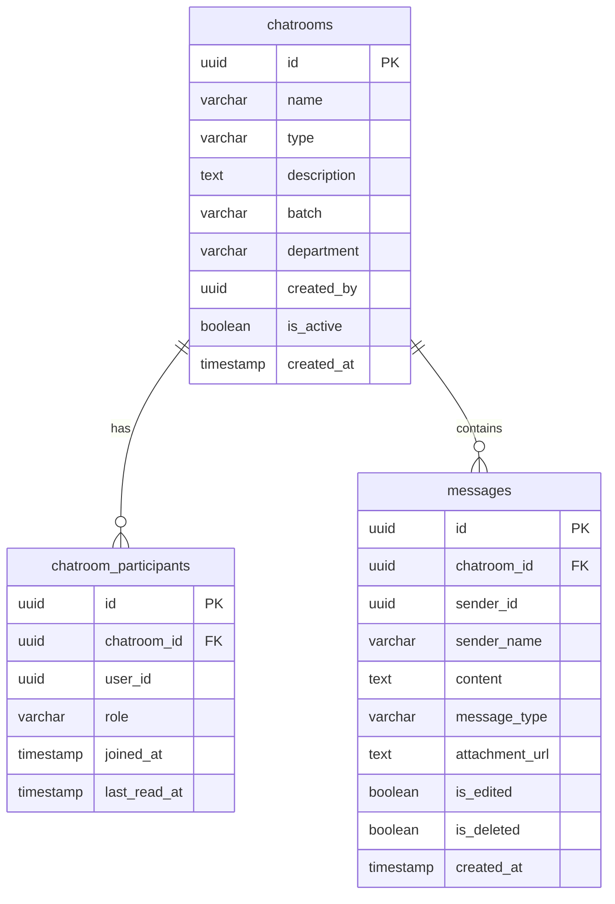
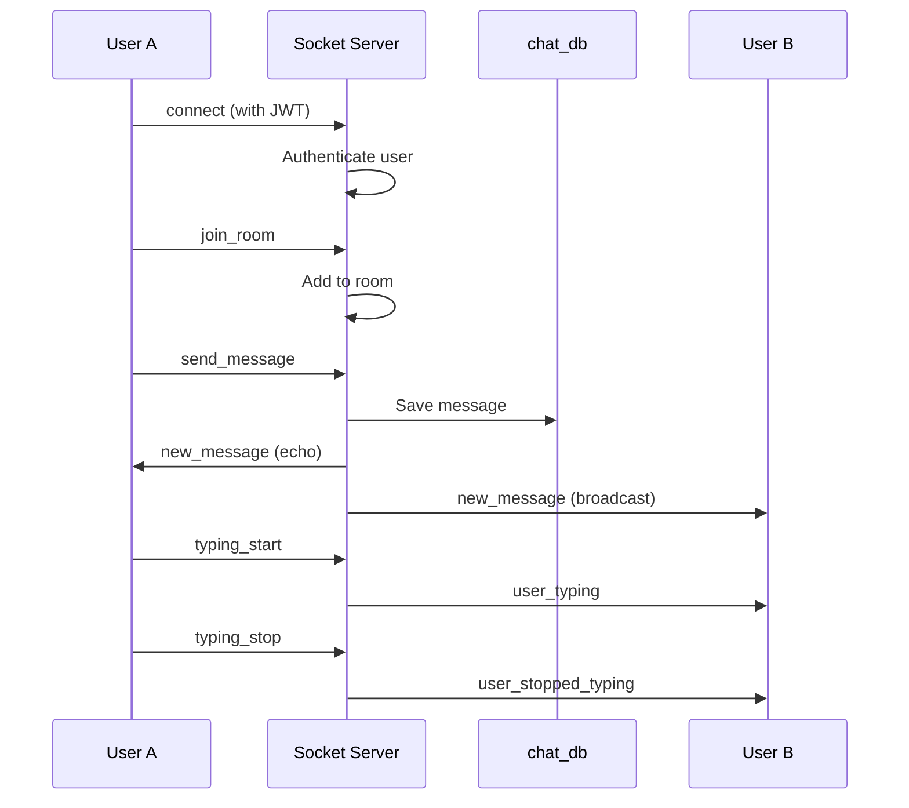

# Chat Service API

<span class="port-indicator">Port 3006</span> <span class="db-tag">chat_db</span>

The Chat service provides real-time messaging with Socket.io for batch-based and direct chat rooms.

---

## Overview

| Property | Value |
|----------|-------|
| **Port** | 3006 |
| **Database** | `chat_db` |
| **Base Path** | `/api/chat` |
| **Real-time** | Socket.io |
| **Auth Required** | Yes (all endpoints) |

## Database Schema

### Tables



---

## REST API Endpoints

### Chatrooms

#### Get User's Chatrooms

<span class="api-method method-get">GET</span> `/chatrooms`

!!! info "Authentication Required"

Returns all chatrooms the user is a member of.

=== "Response"

    ```json
    {
        "success": true,
        "data": [
            {
                "id": "uuid",
                "name": "Batch 52 - CSE",
                "type": "BATCH",
                "description": "Official batch chat",
                "batch": "52",
                "department": "CSE",
                "unread_count": 5,
                "last_message": {
                    "content": "Hello everyone!",
                    "sender_name": "John Doe",
                    "created_at": "2024-01-15T14:30:00Z"
                },
                "participant_count": 45
            }
        ]
    }
    ```

#### Get Chatroom by ID

<span class="api-method method-get">GET</span> `/chatrooms/:id`

Returns chatroom details with recent messages.

=== "Response"

    ```json
    {
        "success": true,
        "data": {
            "id": "uuid",
            "name": "Batch 52 - CSE",
            "type": "BATCH",
            "participants": [
                {
                    "user_id": "uuid",
                    "name": "John Doe",
                    "role": "MEMBER"
                }
            ],
            "messages": [
                {
                    "id": "uuid",
                    "sender_id": "uuid",
                    "sender_name": "Jane Doe",
                    "content": "Hey everyone!",
                    "message_type": "TEXT",
                    "created_at": "2024-01-15T14:30:00Z"
                }
            ]
        }
    }
    ```

#### Create Direct Chat

<span class="api-method method-post">POST</span> `/chatrooms/direct`

Create or get existing direct chat with another user.

=== "Request"

    ```json
    {
        "user_id": "uuid-of-other-user"
    }
    ```

=== "Response"

    ```json
    {
        "success": true,
        "data": {
            "id": "uuid",
            "name": "Direct Chat",
            "type": "DIRECT",
            "is_new": false
        }
    }
    ```

#### Create Group Chat

<span class="api-method method-post">POST</span> `/chatrooms/group`

Create a new group chatroom.

=== "Request"

    ```json
    {
        "name": "Study Group - DSA",
        "description": "Data Structures study group",
        "members": ["uuid1", "uuid2", "uuid3"]
    }
    ```

---

### Messages

#### Get Messages

<span class="api-method method-get">GET</span> `/chatrooms/:id/messages`

Returns paginated messages for a chatroom.

**Query Parameters:**

| Parameter | Type | Description |
|-----------|------|-------------|
| `limit` | number | Messages per page (default: 50) |
| `before` | timestamp | Get messages before this time |
| `after` | timestamp | Get messages after this time |

=== "Response"

    ```json
    {
        "success": true,
        "data": [
            {
                "id": "uuid",
                "sender_id": "uuid",
                "sender_name": "John Doe",
                "content": "Hello!",
                "message_type": "TEXT",
                "is_edited": false,
                "created_at": "2024-01-15T14:30:00Z"
            }
        ],
        "has_more": true
    }
    ```

#### Send Message (REST)

<span class="api-method method-post">POST</span> `/chatrooms/:id/messages`

!!! tip "Prefer Socket.io"
    Use Socket.io for real-time message sending.

=== "Request"

    ```json
    {
        "content": "Hello everyone!",
        "message_type": "TEXT"
    }
    ```

#### Edit Message

<span class="api-method method-put">PUT</span> `/messages/:id`

!!! info "Sender Only"

=== "Request"

    ```json
    {
        "content": "Updated message content"
    }
    ```

#### Delete Message

<span class="api-method method-delete">DELETE</span> `/messages/:id`

!!! info "Sender Only"

Soft deletes the message (sets `is_deleted: true`).

---

### Participants

#### Mark as Read

<span class="api-method method-post">POST</span> `/chatrooms/:id/read`

Updates the user's `last_read_at` timestamp.

=== "Response"

    ```json
    {
        "success": true,
        "message": "Marked as read"
    }
    ```

#### Leave Chatroom

<span class="api-method method-delete">DELETE</span> `/chatrooms/:id/leave`

Leave a group chatroom.

!!! warning "Cannot Leave"
    Users cannot leave BATCH type chatrooms.

---

## Socket.io Events

### Connection

```javascript
import { io } from 'socket.io-client';

const socket = io('http://localhost:3006', {
    auth: {
        token: 'your-jwt-token'
    }
});

socket.on('connect', () => {
    console.log('Connected to chat server');
});
```

### Client → Server Events

#### Join Room

```javascript
socket.emit('join_room', {
    chatroom_id: 'uuid'
});
```

#### Leave Room

```javascript
socket.emit('leave_room', {
    chatroom_id: 'uuid'
});
```

#### Send Message

```javascript
socket.emit('send_message', {
    chatroom_id: 'uuid',
    content: 'Hello everyone!',
    message_type: 'TEXT'
});
```

#### Typing Indicator

```javascript
socket.emit('typing_start', {
    chatroom_id: 'uuid'
});

socket.emit('typing_stop', {
    chatroom_id: 'uuid'
});
```

### Server → Client Events

#### New Message

```javascript
socket.on('new_message', (message) => {
    console.log('New message:', message);
    // {
    //     id: 'uuid',
    //     chatroom_id: 'uuid',
    //     sender_id: 'uuid',
    //     sender_name: 'John Doe',
    //     content: 'Hello!',
    //     message_type: 'TEXT',
    //     created_at: '2024-01-15T14:30:00Z'
    // }
});
```

#### User Typing

```javascript
socket.on('user_typing', ({ chatroom_id, user_id, user_name }) => {
    console.log(`${user_name} is typing...`);
});

socket.on('user_stopped_typing', ({ chatroom_id, user_id }) => {
    // Remove typing indicator
});
```

#### User Online/Offline

```javascript
socket.on('user_online', ({ user_id }) => {
    // Update user's online status
});

socket.on('user_offline', ({ user_id }) => {
    // Update user's offline status
});
```

#### Message Events

```javascript
socket.on('message_edited', ({ message_id, content }) => {
    // Update message in UI
});

socket.on('message_deleted', ({ message_id }) => {
    // Remove or mark message as deleted
});
```

---

## Chatroom Types

| Type | Description | Auto-Join |
|------|-------------|-----------|
| `BATCH` | Batch-specific chatroom | Yes (based on user's batch) |
| `DIRECT` | 1-on-1 private chat | Manual |
| `GROUP` | Custom group chat | Manual (invite) |

---

## Message Types

| Type | Description |
|------|-------------|
| `TEXT` | Plain text message |
| `IMAGE` | Image attachment |
| `FILE` | File attachment |
| `SYSTEM` | System notification |

---

## Real-time Architecture



---

## Error Codes

| Code | Message | Description |
|------|---------|-------------|
| 400 | Invalid message | Empty or too long content |
| 401 | Unauthorized | Invalid or missing JWT |
| 403 | Not a member | User not in chatroom |
| 404 | Chatroom not found | Invalid chatroom ID |
| 403 | Cannot leave batch room | Batch rooms are mandatory |
