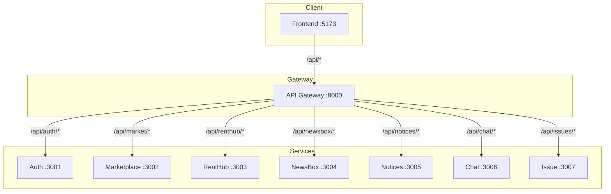
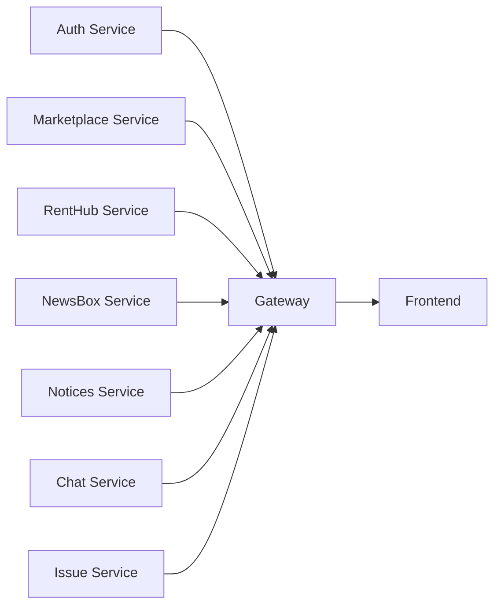

# API Gateway

<span class="port-indicator">Port 8000</span>

The Gateway service routes all API requests to their respective microservices using `http-proxy-middleware`.

---

## Overview

| Property | Value |
|----------|-------|
| **Port** | 8000 |
| **Technology** | Express.js + http-proxy-middleware |
| **Purpose** | API routing, CORS handling |

---

## Route Configuration

All frontend API calls go through the gateway at `http://localhost:8000`:



---

## Proxy Routes

| Gateway Path | Target Service | Service Path |
|--------------|----------------|--------------|
| `/api/auth/*` | `http://localhost:3001` | `/*` |
| `/api/market/*` | `http://localhost:3002` | `/*` |
| `/api/renthub/*` | `http://localhost:3003` | `/*` |
| `/api/newsbox/*` | `http://localhost:3004` | `/*` |
| `/api/notices/*` | `http://localhost:3005/notices` | `/*` |
| `/api/chat/*` | `http://localhost:3006` | `/*` |
| `/api/issues/*` | `http://localhost:3007` | `/*` |

---

## Path Rewriting

The gateway rewrites paths before proxying:

=== "Example: Auth"

    ```
    Client request:  GET /api/auth/profile
    Gateway strips:  /api/auth
    Service receives: GET /profile
    ```

=== "Example: Marketplace"

    ```
    Client request:  GET /api/market/vendors?type=FOOD_VENDOR
    Gateway strips:  /api/market
    Service receives: GET /vendors?type=FOOD_VENDOR
    ```

---

## Gateway Configuration

```javascript
// gateway/server.js

// Auth Service Proxy
app.use('/api/auth', createProxyMiddleware({
    target: 'http://localhost:3001',
    changeOrigin: true,
    pathRewrite: {
        '^/api/auth': '',
    }
}));

// Marketplace Service Proxy
app.use('/api/market', createProxyMiddleware({
    target: 'http://localhost:3002',
    changeOrigin: true,
    pathRewrite: {
        '^/api/market': '',
    }
}));

// ... similar for other services
```

---

## CORS Configuration

The gateway handles CORS for all services:

```javascript
app.use(cors({
    origin: true, // Allow all origins (development)
    credentials: true
}));
```

!!! warning "Production Configuration"
    In production, replace `origin: true` with specific allowed origins:
    ```javascript
    origin: ['https://edusync.uiu.edu', 'https://www.edusync.uiu.edu']
    ```

---

## Logging

All requests are logged to both console and `gateway.log`:

```javascript
app.use((req, res, next) => {
    log(`${req.method} ${req.url}`);
    next();
});
```

=== "Log Output"

    ```
    [2024-01-15T10:30:00.000Z] GET /api/auth/profile
    [2024-01-15T10:30:00.050Z] → Proxying to Auth Service: GET /profile
    [2024-01-15T10:30:05.000Z] POST /api/market/orders
    [2024-01-15T10:30:05.050Z] → Proxying to Marketplace Service: POST /orders
    ```

---

## Error Handling

Each proxy has error handling for unreachable services:

```javascript
onError: (err, req, res) => {
    log(`❌ Auth Proxy Error: ${err.message}`);
    res.status(500).json({ 
        error: 'Could not reach Auth Service', 
        details: err.message 
    });
}
```

=== "Error Response"

    ```json
    {
        "error": "Could not reach Auth Service",
        "details": "connect ECONNREFUSED 127.0.0.1:3001"
    }
    ```

---

## Health Check

<span class="api-method method-get">GET</span> `/`

Returns gateway status.

=== "Response"

    ```
    Gateway is Running
    ```

---

## Service Dependencies

The gateway should start **after** all backend services:



---

## Starting the Gateway

```bash
cd gateway
npm install
npm start
# or
node server.js
```

=== "Expected Output"

    ```
    🚀 Gateway running on http://localhost:8000
    ```

---

## Testing Gateway Routes

Use curl or any HTTP client:

```bash
# Test gateway health
curl http://localhost:8000/

# Test auth service through gateway
curl http://localhost:8000/api/auth/health

# Test marketplace through gateway
curl http://localhost:8000/api/market/vendors

# Test with authentication
curl http://localhost:8000/api/auth/profile \
  -H "Authorization: Bearer YOUR_JWT_TOKEN"
```

---

## Troubleshooting

### Common Issues

| Issue | Cause | Solution |
|-------|-------|----------|
| 502 Bad Gateway | Target service down | Start the target service |
| CORS Error | Origin not allowed | Check CORS configuration |
| Connection Refused | Wrong port | Verify service ports |
| Timeout | Service slow/stuck | Check service logs |

### Debug Mode

Enable verbose logging:

```javascript
const { createProxyMiddleware } = require('http-proxy-middleware');

createProxyMiddleware({
    target: 'http://localhost:3001',
    logLevel: 'debug', // Enable debug logging
    // ...
});
```
