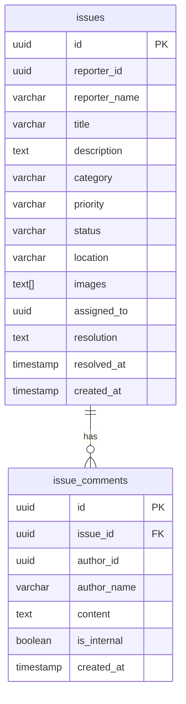
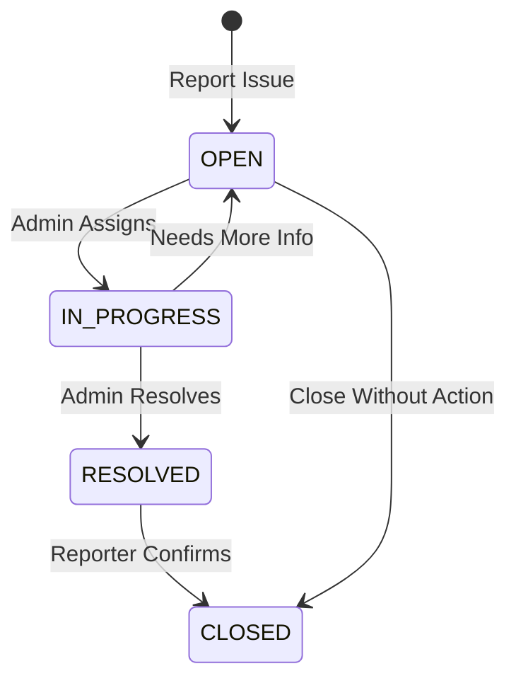

# Issue Service API

<span class="port-indicator">Port 3007</span> <span class="db-tag">issue_db</span>

The Issue service handles campus issue reporting, tracking, and resolution workflow.

---

## Overview

| Property | Value |
|----------|-------|
| **Port** | 3007 |
| **Database** | `issue_db` |
| **Base Path** | `/api/issues` |
| **Auth Required** | Yes (all endpoints) |

## Database Schema

### Tables



---

## API Endpoints

### Issues

#### Get All Issues

<span class="api-method method-get">GET</span> `/`

!!! info "Authentication Required"

Returns issues based on user role (own issues for students, all for admins).

**Query Parameters:**

| Parameter | Type | Description |
|-----------|------|-------------|
| `status` | string | Filter by status |
| `category` | string | Filter by category |
| `priority` | string | Filter by priority |
| `search` | string | Search in title/description |
| `page` | number | Page number |
| `limit` | number | Results per page |

=== "Response"

    ```json
    {
        "success": true,
        "count": 25,
        "data": [
            {
                "id": "uuid",
                "reporter_id": "uuid",
                "reporter_name": "John Doe",
                "title": "Broken AC in Room 405",
                "description": "The AC has been making loud noises...",
                "category": "Maintenance",
                "priority": "MEDIUM",
                "status": "OPEN",
                "location": "Building 5, Room 405",
                "images": ["https://..."],
                "assigned_to": null,
                "created_at": "2024-01-15T10:00:00Z"
            }
        ]
    }
    ```

#### Get Issue by ID

<span class="api-method method-get">GET</span> `/:id`

=== "Response"

    ```json
    {
        "success": true,
        "data": {
            "id": "uuid",
            "reporter_id": "uuid",
            "reporter_name": "John Doe",
            "title": "Broken AC in Room 405",
            "description": "Full description...",
            "category": "Maintenance",
            "priority": "MEDIUM",
            "status": "IN_PROGRESS",
            "location": "Building 5, Room 405",
            "images": ["https://..."],
            "assigned_to": "uuid",
            "assignee_name": "Admin User",
            "comments": [
                {
                    "id": "uuid",
                    "author_name": "Admin User",
                    "content": "We'll send someone today",
                    "is_internal": false,
                    "created_at": "2024-01-15T11:00:00Z"
                }
            ],
            "created_at": "2024-01-15T10:00:00Z",
            "updated_at": "2024-01-15T11:00:00Z"
        }
    }
    ```

#### Create Issue

<span class="api-method method-post">POST</span> `/`

!!! info "Authentication Required"

=== "Request"

    ```json
    {
        "title": "Broken AC in Room 405",
        "description": "The AC has been making loud noises and not cooling properly since yesterday.",
        "category": "Maintenance",
        "priority": "MEDIUM",
        "location": "Building 5, Room 405",
        "images": ["base64-encoded-image"]
    }
    ```

=== "Response"

    ```json
    {
        "success": true,
        "message": "Issue reported successfully",
        "data": {
            "id": "uuid",
            "title": "Broken AC in Room 405",
            "status": "OPEN",
            "created_at": "2024-01-15T10:00:00Z"
        }
    }
    ```

**Categories:**

| Category | Description |
|----------|-------------|
| `Infrastructure` | Building, roads, facilities |
| `Academic` | Course, exam, grading issues |
| `IT` | Network, computer, software |
| `Security` | Safety, access, security concerns |
| `Maintenance` | Repair, cleaning, utilities |
| `Other` | Miscellaneous issues |

**Priorities:**

| Priority | Response Time | Color |
|----------|--------------|-------|
| `LOW` | 1 week | 🟢 Green |
| `MEDIUM` | 3 days | 🟡 Yellow |
| `HIGH` | 24 hours | 🟠 Orange |
| `URGENT` | ASAP | 🔴 Red |

#### Update Issue

<span class="api-method method-put">PUT</span> `/:id`

!!! info "Reporter or Admin"

=== "Request"

    ```json
    {
        "title": "Updated Title",
        "description": "Updated description",
        "priority": "HIGH"
    }
    ```

#### Delete Issue

<span class="api-method method-delete">DELETE</span> `/:id`

!!! warning "Reporter Only"
    Can only delete if status is `OPEN`.

---

### Comments

#### Add Comment

<span class="api-method method-post">POST</span> `/:id/comments`

!!! info "Authentication Required"

=== "Request"

    ```json
    {
        "content": "Any update on this issue?",
        "is_internal": false
    }
    ```

!!! note "Internal Comments"
    Setting `is_internal: true` makes the comment visible only to admins.

=== "Response"

    ```json
    {
        "success": true,
        "data": {
            "id": "uuid",
            "author_name": "John Doe",
            "content": "Any update on this issue?",
            "is_internal": false,
            "created_at": "2024-01-15T12:00:00Z"
        }
    }
    ```

#### Get Issue Comments

<span class="api-method method-get">GET</span> `/:id/comments`

Returns all comments for an issue (internal comments only for admins).

---

### Admin Endpoints

#### Update Issue Status

<span class="api-method method-patch">PATCH</span> `/:id/status`

!!! warning "Admin Only"

=== "Request"

    ```json
    {
        "status": "IN_PROGRESS"
    }
    ```

**Status Transitions:**

| From | To | Description |
|------|-----|-------------|
| `OPEN` | `IN_PROGRESS` | Work started |
| `IN_PROGRESS` | `RESOLVED` | Issue fixed |
| `RESOLVED` | `CLOSED` | Confirmed resolved |
| Any | `CLOSED` | Close without resolution |

#### Assign Issue

<span class="api-method method-patch">PATCH</span> `/:id/assign`

!!! warning "Admin Only"

=== "Request"

    ```json
    {
        "assigned_to": "admin-user-uuid"
    }
    ```

#### Resolve Issue

<span class="api-method method-patch">PATCH</span> `/:id/resolve`

!!! warning "Admin Only"

=== "Request"

    ```json
    {
        "resolution": "Replaced the AC compressor. Issue resolved."
    }
    ```

=== "Response"

    ```json
    {
        "success": true,
        "data": {
            "id": "uuid",
            "status": "RESOLVED",
            "resolution": "Replaced the AC compressor. Issue resolved.",
            "resolved_at": "2024-01-16T15:00:00Z"
        }
    }
    ```

#### Get Issue Statistics

<span class="api-method method-get">GET</span> `/admin/stats`

!!! warning "Admin Only"

=== "Response"

    ```json
    {
        "success": true,
        "data": {
            "total_issues": 150,
            "by_status": {
                "OPEN": 25,
                "IN_PROGRESS": 15,
                "RESOLVED": 100,
                "CLOSED": 10
            },
            "by_category": {
                "Maintenance": 45,
                "IT": 35,
                "Infrastructure": 30,
                "Security": 20,
                "Academic": 15,
                "Other": 5
            },
            "by_priority": {
                "URGENT": 5,
                "HIGH": 20,
                "MEDIUM": 75,
                "LOW": 50
            },
            "avg_resolution_time": "2.5 days"
        }
    }
    ```

---

## Issue Workflow



---

## Status Definitions

| Status | Description |
|--------|-------------|
| `OPEN` | New issue, awaiting assignment |
| `IN_PROGRESS` | Being worked on by assigned admin |
| `RESOLVED` | Fix implemented, awaiting confirmation |
| `CLOSED` | Issue completed or closed |

---

## Error Codes

| Code | Message | Description |
|------|---------|-------------|
| 400 | Invalid request | Missing required fields |
| 401 | Unauthorized | Missing or invalid JWT |
| 403 | Not authorized | Not reporter or admin |
| 404 | Issue not found | Invalid issue ID |
| 409 | Invalid status | Cannot transition to status |
