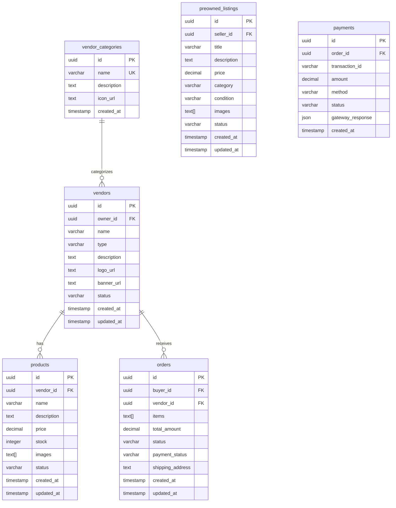
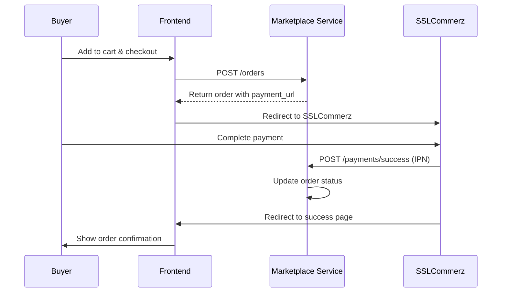

# Marketplace Service API

<span class="port-indicator">Port 3002</span> <span class="db-tag">market_db</span>

The Marketplace service handles vendors, products, preowned listings, orders, and payment processing with SSLCommerz integration.

---

## Overview

| Property | Value |
|----------|-------|
| **Port** | 3002 |
| **Database** | `market_db` |
| **Base Path** | `/api/market` |
| **Payment Gateway** | SSLCommerz (Sandbox) |
| **Body Limit** | 50MB (for images) |

## Database Schema

### Tables



### Vendor Types

- `STARTUP` - Student startups and shops
- `FOOD_VENDOR` - Food and beverage vendors

### Product/Listing Status

- `AVAILABLE` - Active and purchasable
- `SOLD` - Sold (preowned only)
- `UNAVAILABLE` - Temporarily unavailable

---

## API Endpoints

### Vendors

#### Get All Vendors

<span class="api-method method-get">GET</span> `/vendors`

Returns all approved vendors with optional filtering.

**Query Parameters:**

| Parameter | Type | Description |
|-----------|------|-------------|
| `type` | string | `STARTUP` or `FOOD_VENDOR` |
| `status` | string | Filter by status |
| `search` | string | Search by name |

=== "Response"

    ```json
    {
        "success": true,
        "vendors": [
            {
                "id": "uuid",
                "owner_id": "uuid",
                "name": "UIU Tech Hub",
                "type": "STARTUP",
                "description": "Tech accessories shop",
                "logo_url": "https://...",
                "banner_url": "https://...",
                "status": "APPROVED",
                "product_count": 15,
                "created_at": "2024-01-15T10:00:00Z"
            }
        ]
    }
    ```

#### Get Vendor by ID

<span class="api-method method-get">GET</span> `/vendors/:id`

Returns vendor details with their products.

=== "Response"

    ```json
    {
        "success": true,
        "vendor": {
            "id": "uuid",
            "name": "UIU Tech Hub",
            "type": "STARTUP",
            "description": "Tech accessories shop",
            "logo_url": "https://...",
            "banner_url": "https://...",
            "owner": {
                "id": "uuid",
                "name": "John Doe",
                "email": "john@uiu.edu"
            },
            "products": [
                {
                    "id": "uuid",
                    "name": "USB-C Cable",
                    "price": 150.00,
                    "stock": 50,
                    "images": ["https://..."]
                }
            ]
        }
    }
    ```

#### Register Vendor

<span class="api-method method-post">POST</span> `/vendors/register`

!!! info "Authentication Required"

Register as a new vendor.

=== "Request"

    ```json
    {
        "name": "My Shop",
        "type": "STARTUP",
        "description": "Selling tech accessories",
        "logo": "base64-encoded-image",
        "banner": "base64-encoded-image"
    }
    ```

=== "Response"

    ```json
    {
        "success": true,
        "message": "Vendor registration submitted",
        "vendor": {
            "id": "uuid",
            "status": "PENDING"
        }
    }
    ```

!!! note "Approval Required"
    New vendors require admin approval before they can list products.

#### Update Vendor

<span class="api-method method-put">PUT</span> `/vendors/:id`

Update vendor information (owner only).

---

### Products

#### Get Vendor Products

<span class="api-method method-get">GET</span> `/vendors/:vendorId/products`

Returns all products for a vendor.

#### Get Product by ID

<span class="api-method method-get">GET</span> `/products/:id`

=== "Response"

    ```json
    {
        "success": true,
        "product": {
            "id": "uuid",
            "vendor_id": "uuid",
            "vendor_name": "UIU Tech Hub",
            "name": "USB-C Cable",
            "description": "High quality cable...",
            "price": 150.00,
            "stock": 50,
            "images": ["https://..."],
            "status": "AVAILABLE"
        }
    }
    ```

#### Create Product

<span class="api-method method-post">POST</span> `/products`

!!! info "Vendor Required"
    User must be an approved vendor.

=== "Request"

    ```json
    {
        "vendor_id": "uuid",
        "name": "New Product",
        "description": "Product description",
        "price": 299.00,
        "stock": 100,
        "images": ["base64-encoded-image"]
    }
    ```

#### Update Product

<span class="api-method method-put">PUT</span> `/products/:id`

#### Delete Product

<span class="api-method method-delete">DELETE</span> `/products/:id`

---

### Preowned Listings

#### Get All Preowned

<span class="api-method method-get">GET</span> `/preowned`

Returns all available preowned listings.

**Query Parameters:**

| Parameter | Type | Description |
|-----------|------|-------------|
| `category` | string | Filter by category |
| `minPrice` | number | Minimum price |
| `maxPrice` | number | Maximum price |
| `condition` | string | Item condition |
| `search` | string | Search in title/description |

=== "Response"

    ```json
    {
        "success": true,
        "listings": [
            {
                "id": "uuid",
                "seller_id": "uuid",
                "seller_name": "Jane Doe",
                "title": "Used Calculus Textbook",
                "description": "Good condition...",
                "price": 500.00,
                "category": "Books",
                "condition": "GOOD",
                "images": ["https://..."],
                "status": "AVAILABLE",
                "created_at": "2024-01-15T10:00:00Z"
            }
        ]
    }
    ```

#### Get Preowned by ID

<span class="api-method method-get">GET</span> `/preowned/:id`

#### Create Preowned Listing

<span class="api-method method-post">POST</span> `/preowned`

!!! info "Authentication Required"

=== "Request"

    ```json
    {
        "title": "Used Laptop",
        "description": "Dell XPS 13, 2 years old",
        "price": 45000.00,
        "category": "Electronics",
        "condition": "GOOD",
        "images": ["base64-encoded-image"]
    }
    ```

**Conditions:** `NEW`, `LIKE_NEW`, `GOOD`, `FAIR`, `POOR`

**Categories:** `Books`, `Electronics`, `Clothing`, `Accessories`, `Sports`, `Other`

#### Update Preowned

<span class="api-method method-put">PUT</span> `/preowned/:id`

#### Delete Preowned

<span class="api-method method-delete">DELETE</span> `/preowned/:id`

#### Mark as Sold

<span class="api-method method-patch">PATCH</span> `/preowned/:id/sold`

---

### Orders

#### Create Order

<span class="api-method method-post">POST</span> `/orders`

!!! info "Authentication Required"

=== "Request"

    ```json
    {
        "vendor_id": "uuid",
        "items": [
            {
                "product_id": "uuid",
                "quantity": 2,
                "price": 150.00
            }
        ],
        "shipping_address": "UIU Campus, Dhanmondi"
    }
    ```

=== "Response"

    ```json
    {
        "success": true,
        "order": {
            "id": "uuid",
            "total_amount": 300.00,
            "status": "PENDING",
            "payment_url": "https://sandbox.sslcommerz.com/..."
        }
    }
    ```

#### Get User Orders

<span class="api-method method-get">GET</span> `/orders/my`

Returns current user's orders.

#### Get Vendor Orders

<span class="api-method method-get">GET</span> `/orders/vendor/:vendorId`

Returns orders for a vendor (owner only).

#### Update Order Status

<span class="api-method method-patch">PATCH</span> `/orders/:id/status`

=== "Request"

    ```json
    {
        "status": "PROCESSING"
    }
    ```

**Statuses:** `PENDING`, `PROCESSING`, `SHIPPED`, `DELIVERED`, `CANCELLED`

---

### Payments (SSLCommerz)

#### Initiate Payment

<span class="api-method method-post">POST</span> `/payments/initiate`

=== "Request"

    ```json
    {
        "order_id": "uuid",
        "customer_name": "John Doe",
        "customer_email": "john@uiu.edu",
        "customer_phone": "+8801712345678"
    }
    ```

=== "Response"

    ```json
    {
        "success": true,
        "payment_url": "https://sandbox.sslcommerz.com/...",
        "session_key": "..."
    }
    ```

#### Payment Success Callback

<span class="api-method method-post">POST</span> `/payments/success`

SSLCommerz IPN callback for successful payments.

#### Payment Fail Callback

<span class="api-method method-post">POST</span> `/payments/fail`

#### Payment Cancel Callback

<span class="api-method method-post">POST</span> `/payments/cancel`

---

### Admin Endpoints

#### Get Pending Vendors

<span class="api-method method-get">GET</span> `/admin/vendors/pending`

!!! warning "Admin Only"

#### Approve Vendor

<span class="api-method method-post">POST</span> `/admin/vendors/:id/approve`

#### Reject Vendor

<span class="api-method method-post">POST</span> `/admin/vendors/:id/reject`

=== "Request"

    ```json
    {
        "reason": "Incomplete information provided"
    }
    ```

#### Get Analytics

<span class="api-method method-get">GET</span> `/admin/analytics`

Returns marketplace statistics.

=== "Response"

    ```json
    {
        "success": true,
        "analytics": {
            "total_vendors": 45,
            "total_products": 320,
            "total_orders": 156,
            "total_revenue": 125000.00,
            "orders_by_status": {
                "PENDING": 12,
                "PROCESSING": 8,
                "DELIVERED": 130,
                "CANCELLED": 6
            }
        }
    }
    ```

---

## Order & Payment Flow



---

## Error Codes

| Code | Message | Description |
|------|---------|-------------|
| 400 | Invalid request | Missing required fields |
| 401 | Unauthorized | Missing or invalid JWT |
| 403 | Not vendor owner | Not authorized for this vendor |
| 404 | Vendor not found | Invalid vendor ID |
| 404 | Product not found | Invalid product ID |
| 409 | Vendor already exists | User already has a vendor |
| 422 | Insufficient stock | Product out of stock |
| 500 | Payment failed | SSLCommerz error |
