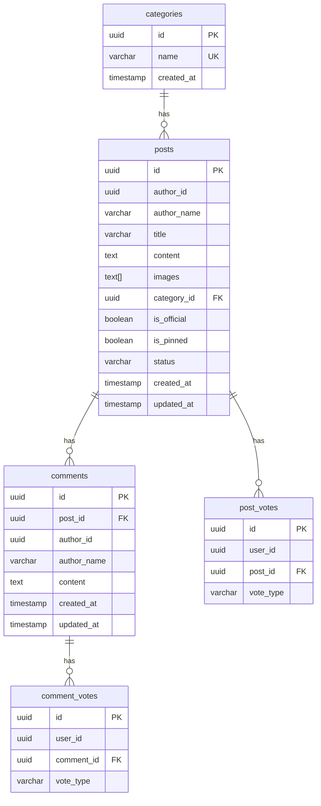
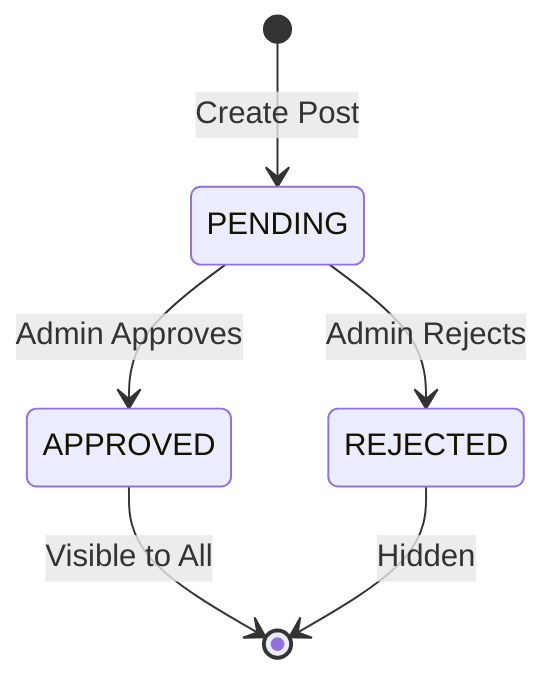

# NewsBox Service API

<span class="port-indicator">Port 3004</span> <span class="db-tag">newsbox_db</span>

The NewsBox service powers the community-driven news feed with posts, comments, and voting functionality.

---

## Overview

| Property | Value |
|----------|-------|
| **Port** | 3004 |
| **Database** | `newsbox_db` |
| **Base Path** | `/api/newsbox` |
| **Auth Required** | Partial (viewing is public, actions require auth) |

## Database Schema

### Tables



### Default Categories

- Campus
- Sports
- Academics
- Career
- Lifestyle
- Tech
- Emergency
- Events

---

## API Endpoints

### Categories

#### Get All Categories

<span class="api-method method-get">GET</span> `/categories`

Returns all available post categories.

=== "Response"

    ```json
    {
        "success": true,
        "data": [
            {
                "id": "uuid",
                "name": "Campus",
                "created_at": "2024-01-15T10:00:00Z"
            }
        ]
    }
    ```

#### Create Category (Admin)

<span class="api-method method-post">POST</span> `/categories`

!!! warning "Admin Only"
    Requires admin authentication.

=== "Request"

    ```json
    {
        "name": "New Category"
    }
    ```

=== "Response"

    ```json
    {
        "success": true,
        "data": {
            "id": "uuid",
            "name": "New Category",
            "created_at": "2024-01-15T10:00:00Z"
        }
    }
    ```

---

### Posts

#### Get All Posts

<span class="api-method method-get">GET</span> `/posts`

Returns all approved posts with optional filtering.

**Query Parameters:**

| Parameter | Type | Description |
|-----------|------|-------------|
| `category` | string | Filter by category name |
| `author_id` | uuid | Filter by author |
| `status` | string | Filter by status (admin only) |
| `limit` | number | Results per page (default: 20) |
| `offset` | number | Pagination offset |

=== "Response"

    ```json
    {
        "success": true,
        "data": [
            {
                "id": "uuid",
                "author_id": "uuid",
                "author_name": "John Doe",
                "title": "Campus Event Announcement",
                "content": "Lorem ipsum...",
                "images": ["https://..."],
                "category_id": "uuid",
                "category_name": "Events",
                "is_official": false,
                "is_pinned": false,
                "status": "APPROVED",
                "upvotes": 15,
                "downvotes": 2,
                "comment_count": 5,
                "created_at": "2024-01-15T10:00:00Z"
            }
        ]
    }
    ```

#### Get Post by ID

<span class="api-method method-get">GET</span> `/posts/:id`

Returns a single post with its comments.

=== "Response"

    ```json
    {
        "success": true,
        "data": {
            "id": "uuid",
            "author_id": "uuid",
            "author_name": "John Doe",
            "title": "Campus Event",
            "content": "Full content...",
            "images": [],
            "category_name": "Events",
            "is_official": false,
            "is_pinned": false,
            "status": "APPROVED",
            "upvotes": 15,
            "downvotes": 2,
            "comments": [
                {
                    "id": "uuid",
                    "author_name": "Jane Smith",
                    "content": "Great post!",
                    "upvotes": 3,
                    "downvotes": 0,
                    "created_at": "2024-01-15T11:00:00Z"
                }
            ],
            "created_at": "2024-01-15T10:00:00Z"
        }
    }
    ```

#### Create Post

<span class="api-method method-post">POST</span> `/posts`

!!! info "Authentication Required"
    Requires valid JWT token.

=== "Request"

    ```json
    {
        "title": "My New Post",
        "content": "Post content here...",
        "category_id": "uuid",
        "images": ["base64 or URL"]
    }
    ```

=== "Response"

    ```json
    {
        "success": true,
        "data": {
            "id": "uuid",
            "title": "My New Post",
            "status": "PENDING",
            "created_at": "2024-01-15T10:00:00Z"
        },
        "message": "Post created and pending approval"
    }
    ```

#### Update Post

<span class="api-method method-put">PUT</span> `/posts/:id`

Update a post (author or admin only).

=== "Request"

    ```json
    {
        "title": "Updated Title",
        "content": "Updated content"
    }
    ```

#### Delete Post

<span class="api-method method-delete">DELETE</span> `/posts/:id`

Delete a post (author or admin only).

---

### Voting

#### Vote on Post

<span class="api-method method-post">POST</span> `/posts/:id/vote`

!!! info "Authentication Required"

=== "Request"

    ```json
    {
        "vote_type": "UP"
    }
    ```

    Vote types: `UP`, `DOWN`, or `null` to remove vote.

=== "Response"

    ```json
    {
        "success": true,
        "data": {
            "upvotes": 16,
            "downvotes": 2
        }
    }
    ```

#### Vote on Comment

<span class="api-method method-post">POST</span> `/comments/:id/vote`

=== "Request"

    ```json
    {
        "vote_type": "UP"
    }
    ```

---

### Comments

#### Add Comment

<span class="api-method method-post">POST</span> `/posts/:id/comments`

!!! info "Authentication Required"

=== "Request"

    ```json
    {
        "content": "This is my comment"
    }
    ```

=== "Response"

    ```json
    {
        "success": true,
        "data": {
            "id": "uuid",
            "post_id": "uuid",
            "author_name": "Current User",
            "content": "This is my comment",
            "created_at": "2024-01-15T12:00:00Z"
        }
    }
    ```

#### Get Post Comments

<span class="api-method method-get">GET</span> `/posts/:id/comments`

Returns all comments for a post.

#### Delete Comment

<span class="api-method method-delete">DELETE</span> `/comments/:id`

Delete a comment (author only).

---

### Admin Endpoints

#### Get Pending Posts

<span class="api-method method-get">GET</span> `/admin/posts/pending`

!!! warning "Admin Only"

Returns all posts awaiting approval.

#### Update Post Status

<span class="api-method method-patch">PATCH</span> `/admin/posts/:id/status`

=== "Request"

    ```json
    {
        "status": "APPROVED"
    }
    ```

    Status options: `PENDING`, `APPROVED`, `REJECTED`

#### Toggle Pin Status

<span class="api-method method-patch">PATCH</span> `/admin/posts/:id/pin`

Pin or unpin a post to the top of the feed.

---

## Post Status Workflow



---

## Error Codes

| Code | Message | Description |
|------|---------|-------------|
| 400 | Invalid request | Missing required fields |
| 401 | Unauthorized | Missing or invalid JWT |
| 403 | Forbidden | Not author or admin |
| 404 | Post not found | Invalid post ID |
| 409 | Already voted | User already voted |
