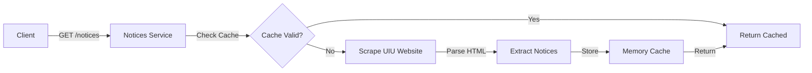
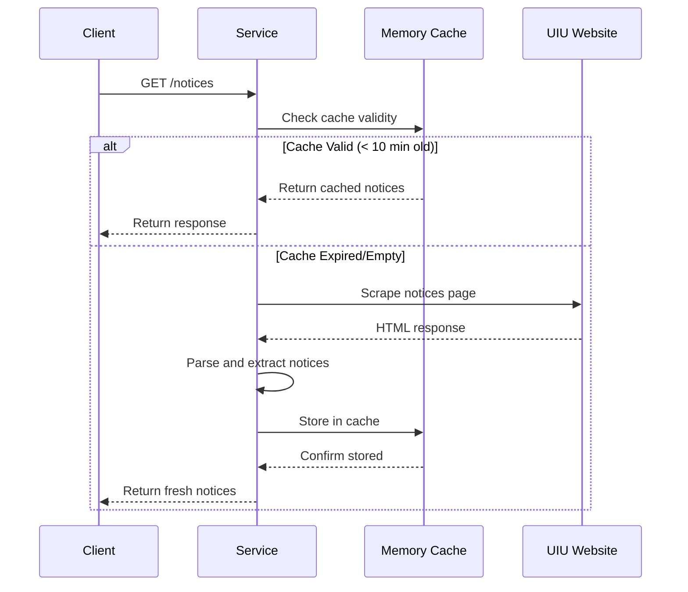

# Notices Service API

<span class="port-indicator">Port 3005</span> <span class="cache-tag">In-Memory Cache</span>

The Notices service scrapes and serves official UIU notices from the university website.

---

## Overview

| Property | Value |
|----------|-------|
| **Port** | 3005 |
| **Database** | None (In-memory cache) |
| **Base Path** | `/api/notices` |
| **Source** | `https://www.uiu.ac.bd/notice/` |
| **Auth Required** | No (Public) |
| **Cache Duration** | 10 minutes |

!!! info "No Database Required"
    This service doesn't use a database. It scrapes notices from the official UIU website and caches them in memory for performance.

---

## Architecture



---

## API Endpoints

### Get All Notices

<span class="api-method method-get">GET</span> `/`

Returns all scraped notices from UIU official website.

**Query Parameters:**

| Parameter | Type | Description |
|-----------|------|-------------|
| `limit` | number | Maximum notices to return |
| `page` | number | Page number for pagination |
| `search` | string | Search in title/content |
| `category` | string | Filter by category |

=== "Response"

    ```json
    {
        "success": true,
        "count": 50,
        "source": "https://www.uiu.ac.bd/notice/",
        "cached_at": "2024-01-15T10:00:00Z",
        "data": [
            {
                "id": "notice-001",
                "title": "Spring 2024 Registration Notice",
                "content": "All students are requested to complete registration...",
                "date": "2024-01-10",
                "category": "Academic",
                "url": "https://www.uiu.ac.bd/notice/spring-2024-registration",
                "attachment_url": "https://www.uiu.ac.bd/wp-content/uploads/..."
            }
        ]
    }
    ```

### Get Notice by ID

<span class="api-method method-get">GET</span> `/:id`

Returns a specific notice by its ID.

=== "Response"

    ```json
    {
        "success": true,
        "data": {
            "id": "notice-001",
            "title": "Spring 2024 Registration Notice",
            "content": "Full notice content...",
            "date": "2024-01-10",
            "category": "Academic",
            "url": "https://www.uiu.ac.bd/notice/spring-2024-registration",
            "attachment_url": "https://www.uiu.ac.bd/wp-content/uploads/notice.pdf",
            "scraped_at": "2024-01-15T10:00:00Z"
        }
    }
    ```

### Refresh Cache

<span class="api-method method-post">POST</span> `/refresh`

!!! warning "Admin Only"
    Requires admin authentication to prevent abuse.

Forces a refresh of the notices cache by re-scraping the UIU website.

=== "Response"

    ```json
    {
        "success": true,
        "message": "Cache refreshed successfully",
        "notice_count": 50,
        "cached_at": "2024-01-15T10:05:00Z"
    }
    ```

### Health Check

<span class="api-method method-get">GET</span> `/health`

Returns service health status and cache information.

=== "Response"

    ```json
    {
        "status": "healthy",
        "cache": {
            "is_valid": true,
            "notice_count": 50,
            "last_updated": "2024-01-15T10:00:00Z",
            "expires_at": "2024-01-15T10:10:00Z"
        },
        "source": {
            "url": "https://www.uiu.ac.bd/notice/",
            "last_scrape_status": "success"
        }
    }
    ```

---

## Notice Categories

Notices are automatically categorized based on content:

| Category | Keywords |
|----------|----------|
| `Academic` | Registration, exam, result, semester |
| `Admission` | Admission, intake, enrollment |
| `Event` | Event, seminar, workshop, ceremony |
| `Holiday` | Holiday, vacation, eid, puja |
| `Administrative` | Office, administrative, hr |
| `Other` | Default category |

---

## Caching Strategy



### Cache Configuration

| Setting | Value |
|---------|-------|
| TTL (Time to Live) | 10 minutes |
| Max Notices | 100 |
| Scrape Timeout | 30 seconds |
| Retry on Failure | 3 attempts |

---

## Error Handling

### Scraping Failures

If the UIU website is unreachable:

1. Service attempts 3 retries with exponential backoff
2. If all retries fail, returns stale cache (if available)
3. If no cache, returns error response

=== "Error Response"

    ```json
    {
        "success": false,
        "error": "Unable to fetch notices",
        "message": "UIU website is currently unreachable",
        "cached_data_available": true,
        "cache_age": "25 minutes"
    }
    ```

---

## Rate Limiting

| Endpoint | Limit |
|----------|-------|
| `GET /` | 100 requests/minute |
| `GET /:id` | 100 requests/minute |
| `POST /refresh` | 1 request/minute |

---

## Error Codes

| Code | Message | Description |
|------|---------|-------------|
| 404 | Notice not found | Invalid notice ID |
| 429 | Too many requests | Rate limit exceeded |
| 500 | Scraping failed | Cannot reach UIU website |
| 503 | Service unavailable | Cache empty and scrape failed |

---

## Example Usage

### Fetch Latest Notices

```javascript
// Fetch 10 latest notices
const response = await fetch('/api/notices?limit=10');
const { data } = await response.json();

data.forEach(notice => {
    console.log(`${notice.date}: ${notice.title}`);
});
```

### Search Notices

```javascript
// Search for exam-related notices
const response = await fetch('/api/notices?search=exam');
const { data } = await response.json();

console.log(`Found ${data.length} exam-related notices`);
```

### Filter by Category

```javascript
// Get only academic notices
const response = await fetch('/api/notices?category=Academic');
const { data } = await response.json();
```
