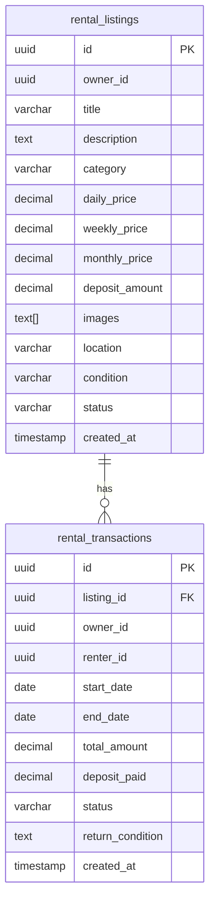
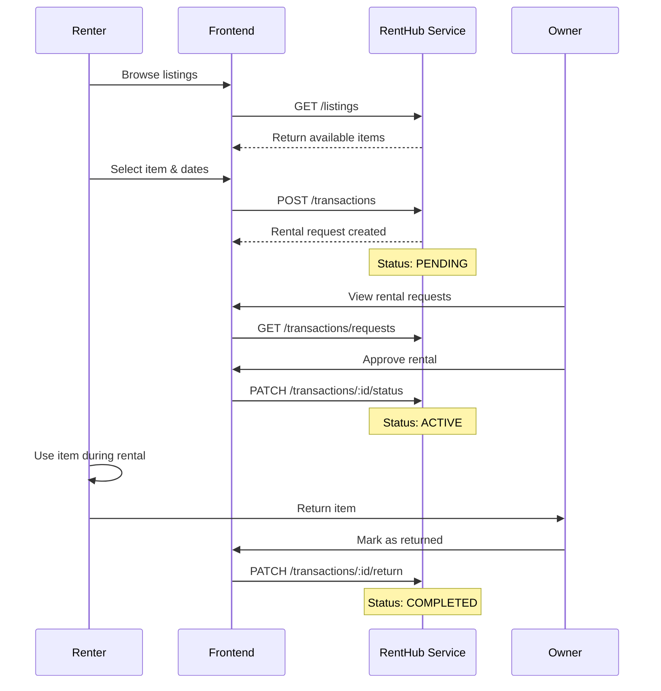

# RentHub Service API

<span class="port-indicator">Port 3003</span> <span class="db-tag">rent_db</span>

The RentHub service manages peer-to-peer rental listings and transactions for campus items.

---

## Overview

| Property | Value |
|----------|-------|
| **Port** | 3003 |
| **Database** | `rent_db` |
| **Base Path** | `/api/renthub` |
| **Auth Required** | Partial (viewing is public) |

## Database Schema

### Tables



---

## API Endpoints

### Listings

#### Get All Listings

<span class="api-method method-get">GET</span> `/listings`

Returns all available rental listings.

**Query Parameters:**

| Parameter | Type | Description |
|-----------|------|-------------|
| `category` | string | Filter by category |
| `status` | string | Filter by status (default: AVAILABLE) |
| `minPrice` | number | Minimum daily price |
| `maxPrice` | number | Maximum daily price |
| `search` | string | Search in title/description |
| `limit` | number | Results per page |
| `offset` | number | Pagination offset |

=== "Response"

    ```json
    {
        "success": true,
        "count": 18,
        "data": [
            {
                "id": "uuid",
                "owner_id": "uuid",
                "owner_name": "John Doe",
                "title": "Calculus Textbook",
                "description": "Stewart Calculus 8th Ed",
                "category": "Books",
                "daily_price": 20.00,
                "weekly_price": 100.00,
                "monthly_price": 350.00,
                "deposit_amount": 200.00,
                "images": ["https://..."],
                "location": "UIU Campus",
                "condition": "GOOD",
                "status": "AVAILABLE",
                "created_at": "2024-01-15T10:00:00Z"
            }
        ]
    }
    ```

#### Get Listing by ID

<span class="api-method method-get">GET</span> `/listings/:id`

=== "Response"

    ```json
    {
        "success": true,
        "data": {
            "id": "uuid",
            "owner_id": "uuid",
            "owner": {
                "name": "John Doe",
                "email": "john@uiu.edu",
                "phone": "+8801712345678"
            },
            "title": "Calculus Textbook",
            "description": "Full description...",
            "category": "Books",
            "daily_price": 20.00,
            "weekly_price": 100.00,
            "monthly_price": 350.00,
            "deposit_amount": 200.00,
            "images": ["https://..."],
            "location": "UIU Campus, Building 5",
            "condition": "GOOD",
            "status": "AVAILABLE",
            "created_at": "2024-01-15T10:00:00Z"
        }
    }
    ```

#### Create Listing

<span class="api-method method-post">POST</span> `/listings`

!!! info "Authentication Required"

=== "Request"

    ```json
    {
        "title": "Guitar for Rent",
        "description": "Yamaha acoustic guitar",
        "category": "Instruments",
        "daily_price": 100.00,
        "weekly_price": 500.00,
        "monthly_price": 1500.00,
        "deposit_amount": 2000.00,
        "images": ["base64-encoded-image"],
        "location": "UIU Dhanmondi",
        "condition": "LIKE_NEW"
    }
    ```

=== "Response"

    ```json
    {
        "success": true,
        "message": "Listing created successfully",
        "data": {
            "id": "uuid",
            "title": "Guitar for Rent",
            "status": "AVAILABLE"
        }
    }
    ```

**Categories:**

| Category | Description |
|----------|-------------|
| `Books` | Textbooks, novels, references |
| `Electronics` | Laptops, tablets, cameras |
| `Sports` | Sports equipment, gear |
| `Instruments` | Musical instruments |
| `Furniture` | Chairs, desks, shelves |
| `Tools` | Study tools, equipment |
| `Clothing` | Formal wear, costumes |
| `Other` | Miscellaneous items |

**Conditions:**

- `NEW` - Brand new, unused
- `LIKE_NEW` - Barely used, excellent
- `GOOD` - Normal wear, fully functional
- `FAIR` - Visible wear, works fine

#### Update Listing

<span class="api-method method-put">PUT</span> `/listings/:id`

!!! info "Owner Only"

=== "Request"

    ```json
    {
        "title": "Updated Title",
        "daily_price": 150.00,
        "status": "UNAVAILABLE"
    }
    ```

#### Delete Listing

<span class="api-method method-delete">DELETE</span> `/listings/:id`

!!! info "Owner Only"

---

### User Listings

#### Get My Listings

<span class="api-method method-get">GET</span> `/listings/my`

!!! info "Authentication Required"

Returns all listings owned by the current user.

=== "Response"

    ```json
    {
        "success": true,
        "data": [
            {
                "id": "uuid",
                "title": "My Guitar",
                "status": "AVAILABLE",
                "daily_price": 100.00,
                "active_rentals": 0,
                "total_earnings": 500.00
            }
        ]
    }
    ```

---

### Transactions

#### Create Rental Request

<span class="api-method method-post">POST</span> `/transactions`

!!! info "Authentication Required"

=== "Request"

    ```json
    {
        "listing_id": "uuid",
        "start_date": "2024-02-01",
        "end_date": "2024-02-07",
        "notes": "I need it for my exam week"
    }
    ```

=== "Response"

    ```json
    {
        "success": true,
        "message": "Rental request submitted",
        "data": {
            "id": "uuid",
            "listing_id": "uuid",
            "status": "PENDING",
            "total_amount": 140.00,
            "deposit_paid": 0
        }
    }
    ```

!!! note "Pricing Calculation"
    - 1-6 days: Daily rate × days
    - 7-29 days: Weekly rate × weeks (rounded up)
    - 30+ days: Monthly rate × months (rounded up)

#### Get My Rentals

<span class="api-method method-get">GET</span> `/transactions/renting`

!!! info "Authentication Required"

Returns items the current user is renting.

=== "Response"

    ```json
    {
        "success": true,
        "data": [
            {
                "id": "uuid",
                "listing": {
                    "id": "uuid",
                    "title": "Calculus Textbook",
                    "owner_name": "Jane Doe"
                },
                "start_date": "2024-02-01",
                "end_date": "2024-02-07",
                "total_amount": 140.00,
                "status": "ACTIVE"
            }
        ]
    }
    ```

#### Get Rental Requests (Owner)

<span class="api-method method-get">GET</span> `/transactions/requests`

!!! info "Authentication Required"

Returns pending rental requests for the owner's listings.

#### Approve/Reject Request

<span class="api-method method-patch">PATCH</span> `/transactions/:id/status`

!!! info "Owner Only"

=== "Request - Approve"

    ```json
    {
        "status": "ACTIVE"
    }
    ```

=== "Request - Reject"

    ```json
    {
        "status": "CANCELLED",
        "reason": "Item already rented"
    }
    ```

#### Mark as Returned

<span class="api-method method-patch">PATCH</span> `/transactions/:id/return`

!!! info "Owner Only"

=== "Request"

    ```json
    {
        "return_condition": "Good condition, minor wear",
        "refund_deposit": true
    }
    ```

---

### Dashboard

#### Get Rental Statistics

<span class="api-method method-get">GET</span> `/dashboard/stats`

!!! info "Authentication Required"

=== "Response"

    ```json
    {
        "success": true,
        "data": {
            "total_listings": 5,
            "active_listings": 3,
            "items_rented_out": 2,
            "items_renting": 1,
            "total_earnings": 2500.00,
            "pending_requests": 3
        }
    }
    ```

---

## Transaction Flow



---

## Transaction Statuses

| Status | Description |
|--------|-------------|
| `PENDING` | Request submitted, awaiting owner approval |
| `ACTIVE` | Approved and currently rented |
| `COMPLETED` | Item returned successfully |
| `CANCELLED` | Request rejected or cancelled |

---

## Error Codes

| Code | Message | Description |
|------|---------|-------------|
| 400 | Invalid dates | End date before start date |
| 400 | Item not available | Already rented for dates |
| 401 | Unauthorized | Missing or invalid JWT |
| 403 | Not owner | Cannot modify others' listings |
| 404 | Listing not found | Invalid listing ID |
| 409 | Already rented | Item already in active rental |
