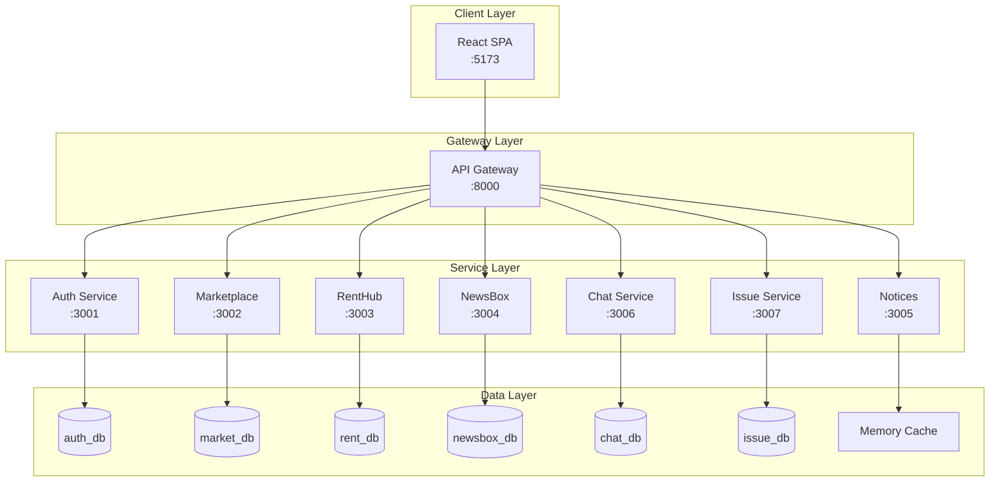
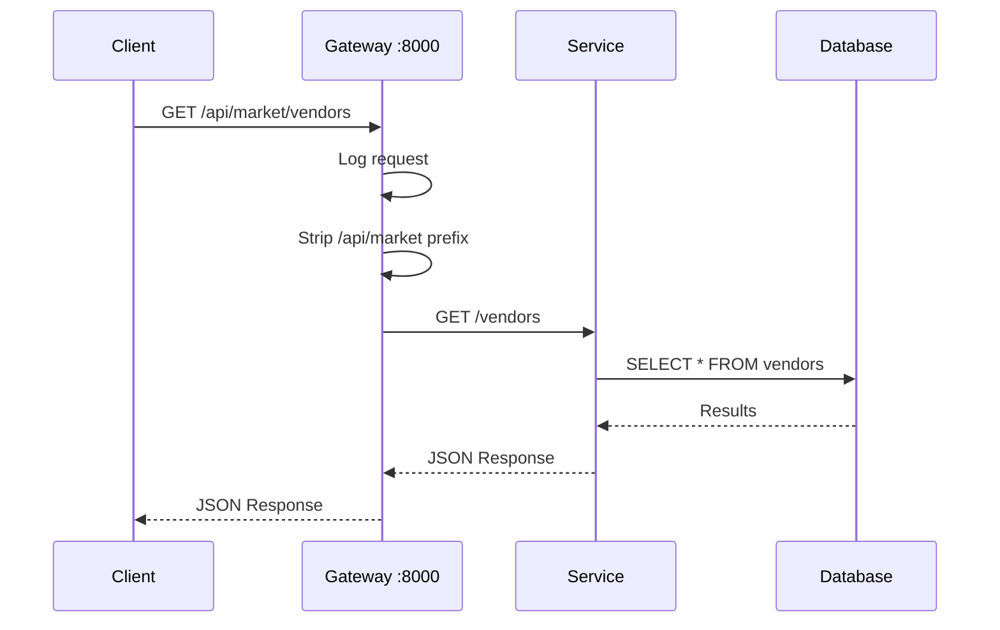
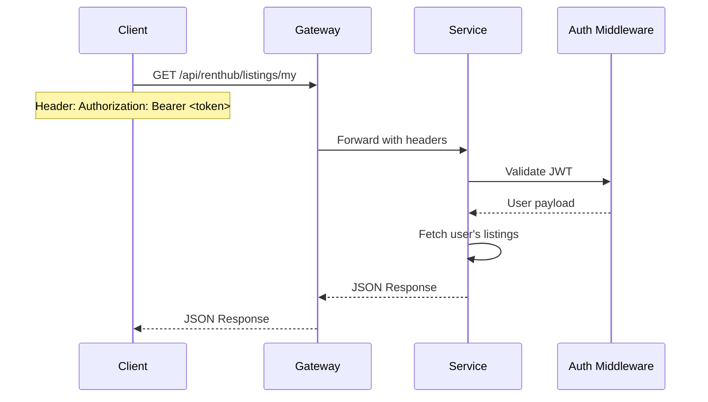
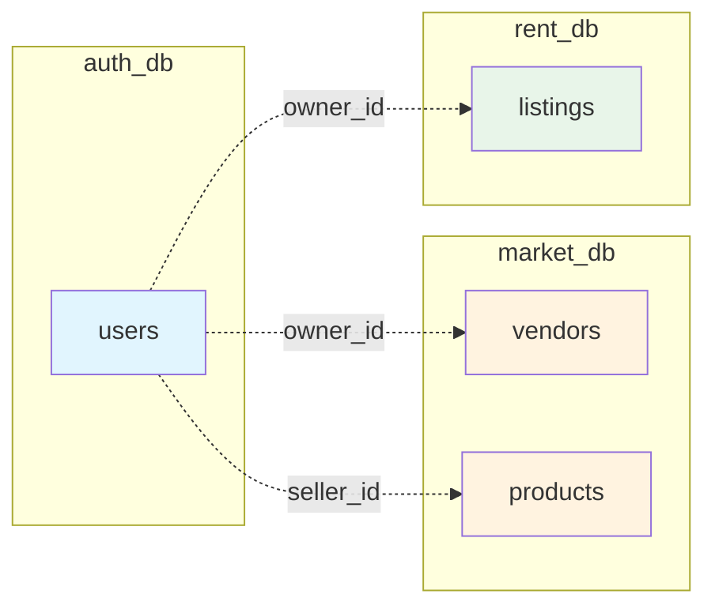
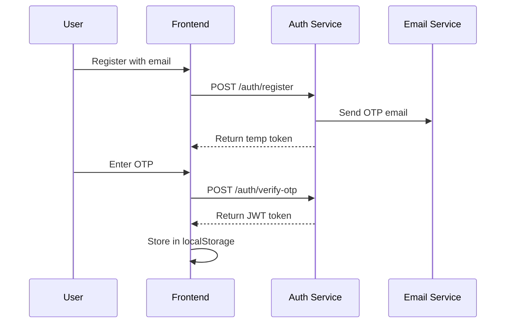

# Architecture Overview

EduSync follows a microservices architecture with a React frontend communicating through an API Gateway.

---

## High-Level Architecture



---

## Design Principles

### 1. Service Independence
Each microservice is:

- **Self-contained**: Has its own database
- **Independently deployable**: Can be updated without affecting others
- **Single responsibility**: Handles one domain

### 2. API Gateway Pattern
All client requests pass through the gateway:

- **Unified entry point**: Single URL for all APIs
- **Path rewriting**: Simplifies client-side routing
- **CORS handling**: Centralized cross-origin configuration

### 3. Stateless Authentication
JWT-based authentication:

- **Token-based**: No server-side sessions
- **Distributed**: Any service can validate tokens
- **Self-contained**: User info embedded in token

---

## Technology Stack

### Frontend
| Technology | Version | Purpose |
|------------|---------|---------|
| React | 19.2.0 | UI Framework |
| Vite | 7.2.4 | Build Tool |
| React Router | 7.10.1 | Client-side Routing |
| TailwindCSS | 3.4.17 | Styling |
| Socket.io Client | 4.7.2 | Real-time Communication |
| Axios | 1.9.0 | HTTP Client |

### Backend
| Technology | Version | Purpose |
|------------|---------|---------|
| Node.js | 18+ | Runtime |
| Express.js | 4.x | Web Framework |
| PostgreSQL | 14+ | Database |
| Socket.io | 4.7.2 | WebSocket Server |
| JWT | - | Authentication |
| bcrypt | - | Password Hashing |

### Infrastructure
| Component | Technology |
|-----------|------------|
| Database Hosting | Aiven Cloud PostgreSQL |
| Payment Gateway | SSLCommerz (Sandbox) |
| Email Service | Nodemailer (Gmail) |

---

## Request Flow

### Typical API Request



### Authenticated Request



---

## Data Flow

### Cross-Service Communication

Services are **stateless** and don't communicate directly. Data correlation happens through:

1. **User IDs**: UUID references across databases
2. **Frontend Orchestration**: Client fetches from multiple services
3. **Gateway Routing**: Single entry point for all requests



---

## Security Architecture

### Authentication Flow



### JWT Token Structure

```json
{
    "id": "user-uuid",
    "email": "student@uiu.edu",
    "name": "John Doe",
    "roles": ["STUDENT", "VENDOR"],
    "activeRole": "STUDENT",
    "department": "CSE",
    "batch": "52",
    "iat": 1705312800,
    "exp": 1705917600
}
```

---

## Deployment Architecture

### Development

```
┌─────────────────────────────────────────────────────────┐
│                    Developer Machine                     │
├─────────────────────────────────────────────────────────┤
│  ┌─────────┐  ┌─────────┐  ┌─────────┐  ┌─────────┐    │
│  │ Service │  │ Service │  │ Service │  │ Gateway │    │
│  │  :3001  │  │  :3002  │  │  :3003  │  │  :8000  │    │
│  └─────────┘  └─────────┘  └─────────┘  └─────────┘    │
│                        ...                               │
│  ┌─────────────────────────────────────────────────────┐│
│  │              Frontend (Vite) :5173                  ││
│  └─────────────────────────────────────────────────────┘│
└─────────────────────────────────────────────────────────┘
                           │
                           ▼
          ┌────────────────────────────┐
          │   Aiven Cloud PostgreSQL   │
          │   (6 databases)            │
          └────────────────────────────┘
```

### Production (Recommended)

```
                    ┌──────────────┐
                    │   Vercel /   │
                    │   Netlify    │
                    │  (Frontend)  │
                    └──────┬───────┘
                           │
                    ┌──────▼───────┐
                    │  API Gateway │
                    │   (Railway)  │
                    └──────┬───────┘
                           │
    ┌──────────────────────┼──────────────────────┐
    │                      │                      │
┌───▼───┐  ┌───▼───┐  ┌───▼───┐  ┌───▼───┐  ...
│ Auth  │  │Market │  │ Rent  │  │ Chat  │
│Service│  │Service│  │Service│  │Service│
└───┬───┘  └───┬───┘  └───┬───┘  └───┬───┘
    │          │          │          │
    └──────────┴──────────┴──────────┘
                    │
          ┌────────▼────────┐
          │ Aiven PostgreSQL│
          └─────────────────┘
```

---

## Scalability Considerations

### Current Limitations

- **Single instances**: Each service runs as one instance
- **Shared database**: All services use same Aiven cluster
- **Base64 images**: Images stored in database (no CDN)

### Future Improvements

- **Containerization**: Docker for each service
- **Load balancing**: Multiple service instances
- **Object storage**: S3/Cloudinary for images
- **Message queue**: RabbitMQ for async operations
