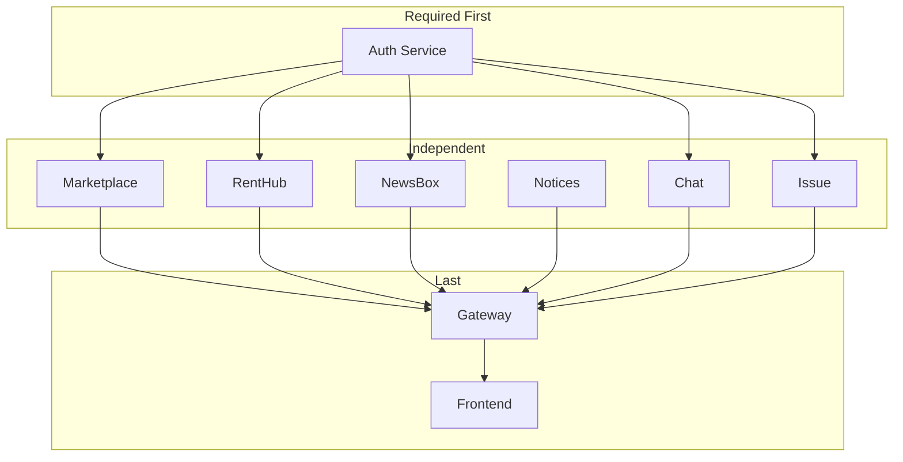

# Services Overview

Detailed breakdown of all EduSync microservices.

---

## Service Summary

| Service | Port | Database | Description |
|---------|------|----------|-------------|
| **Auth** | 3001 | auth_db | Authentication & user management |
| **Marketplace** | 3002 | market_db | Vendors, products, orders, payments |
| **RentHub** | 3003 | rent_db | Rental listings & transactions |
| **NewsBox** | 3004 | newsbox_db | Community news feed |
| **Notices** | 3005 | Memory | UIU notice scraper |
| **Chat** | 3006 | chat_db | Real-time messaging |
| **Issue** | 3007 | issue_db | Issue reporting system |
| **Gateway** | 8000 | - | API routing |

---

## Auth Service <span class="port-indicator">3001</span>

Handles all authentication and user management.

### Features
- OTP-based email verification
- JWT token authentication
- Multi-role support (Student, Vendor, Admin)
- Profile management
- Password reset flow
- Activity logging
- Admin user management

### Key Technologies
- bcrypt for password hashing
- jsonwebtoken for JWT
- Nodemailer for OTP emails

### API Routes
```
POST /auth/register
POST /auth/verify-otp
POST /auth/login
POST /auth/forgot-password
GET  /auth/profile
PUT  /auth/profile
POST /auth/switch-role
GET  /auth/admin/users
```

---

## Marketplace Service <span class="port-indicator">3002</span>

Campus e-commerce platform.

### Features
- Vendor registration and management
- Product listings (Shop-first model)
- Preowned item listings (Product-first model)
- Order management
- SSLCommerz payment integration
- Admin analytics dashboard

### Business Models
1. **Vendors (Shops)**: Startups and food vendors with product catalogs
2. **Preowned**: Direct peer-to-peer listings

### Key Technologies
- SSLCommerz payment gateway
- 50MB body limit for images

### API Routes
```
GET  /vendors
GET  /vendors/:id
POST /vendors/register
GET  /products/:id
POST /products
GET  /preowned
POST /preowned
POST /orders
GET  /orders/my
POST /payments/initiate
```

---

## RentHub Service <span class="port-indicator">3003</span>

Peer-to-peer rental platform.

### Features
- Rental listing creation
- Multi-tier pricing (daily, weekly, monthly)
- Rental request workflow
- Transaction management
- Owner/renter dashboards

### Rental Categories
Books, Electronics, Sports, Instruments, Furniture, Tools, Clothing

### API Routes
```
GET  /listings
GET  /listings/:id
POST /listings
GET  /listings/my
POST /transactions
GET  /transactions/renting
PATCH /transactions/:id/status
```

---

## NewsBox Service <span class="port-indicator">3004</span>

Community-driven news feed.

### Features
- Post creation and moderation
- Category-based organization
- Upvote/downvote system
- Comment system with voting
- Post pinning (admin)
- Approval workflow

### Post Categories
Campus, Sports, Academics, Career, Lifestyle, Tech, Emergency, Events

### API Routes
```
GET  /categories
GET  /posts
GET  /posts/:id
POST /posts
POST /posts/:id/vote
POST /posts/:id/comments
POST /comments/:id/vote
PATCH /admin/posts/:id/status
```

---

## Notices Service <span class="port-indicator">3005</span>

UIU notice aggregator.

### Features
- Web scraping from uiu.ac.bd/notice/
- In-memory caching (no database)
- Automatic categorization
- 10-minute cache TTL

### Key Technologies
- Cheerio for HTML parsing
- In-memory cache

### API Routes
```
GET  /
GET  /:id
POST /refresh (admin)
GET  /health
```

---

## Chat Service <span class="port-indicator">3006</span>

Real-time messaging system.

### Features
- Batch-based chatrooms (auto-join)
- Direct messaging (1-on-1)
- Group chats
- Real-time with Socket.io
- Typing indicators
- Online presence
- Message history

### Chatroom Types
- **BATCH**: Auto-assigned based on student batch
- **DIRECT**: Private 1-on-1 conversations
- **GROUP**: Custom group chats

### Key Technologies
- Socket.io for WebSocket
- JWT authentication via socket handshake

### API Routes
```
GET  /chatrooms
GET  /chatrooms/:id
POST /chatrooms/direct
POST /chatrooms/group
GET  /chatrooms/:id/messages
POST /chatrooms/:id/messages
```

### Socket Events
```
emit: join_room, leave_room, send_message, typing_start, typing_stop
on:   new_message, user_typing, user_online, user_offline
```

---

## Issue Service <span class="port-indicator">3007</span>

Campus issue reporting and tracking.

### Features
- Issue creation with images
- Priority levels (Low, Medium, High, Urgent)
- Status tracking workflow
- Admin assignment
- Internal/public comments
- Resolution tracking
- Analytics dashboard

### Issue Categories
Infrastructure, Academic, IT, Security, Maintenance, Other

### Status Flow
```
OPEN → IN_PROGRESS → RESOLVED → CLOSED
```

### API Routes
```
GET  /
GET  /:id
POST /
PUT  /:id
POST /:id/comments
PATCH /:id/status (admin)
PATCH /:id/assign (admin)
PATCH /:id/resolve (admin)
GET  /admin/stats
```

---

## API Gateway <span class="port-indicator">8000</span>

Request routing and CORS handling.

### Features
- Path-based routing
- Path rewriting
- CORS configuration
- Request logging
- Error handling

### Route Mapping

| Path | Target |
|------|--------|
| `/api/auth/*` | Auth Service :3001 |
| `/api/market/*` | Marketplace :3002 |
| `/api/renthub/*` | RentHub :3003 |
| `/api/newsbox/*` | NewsBox :3004 |
| `/api/notices/*` | Notices :3005 |
| `/api/chat/*` | Chat :3006 |
| `/api/issues/*` | Issue :3007 |

---

## Service Dependencies



### Startup Order

1. **Auth Service** (required for JWT validation)
2. **All other services** (can start in parallel)
3. **Gateway** (requires services to be running)
4. **Frontend** (requires gateway)

---

## Health Checks

| Service | Endpoint | Response |
|---------|----------|----------|
| Auth | `/health` | `{ status: 'ok' }` |
| Marketplace | `/` | Service info |
| RentHub | `/health` | `{ status: 'ok' }` |
| NewsBox | `/health` | `{ status: 'ok' }` |
| Notices | `/health` | Cache status |
| Chat | `/health` | `{ status: 'ok' }` |
| Issue | `/health` | `{ status: 'ok' }` |
| Gateway | `/` | "Gateway is Running" |
