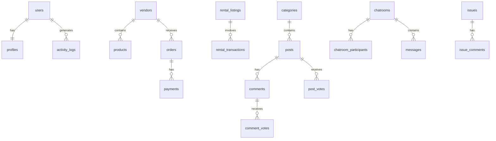

# Database Schema

Complete database schemas for all six EduSync databases hosted on Aiven PostgreSQL.

---

## Database Overview

| Database | Service | Purpose |
|----------|---------|---------|
| `auth_db` | Auth Service (3001) | User authentication, profiles, activity logs |
| `market_db` | Marketplace Service (3002) | Vendors, products, orders, payments |
| `rent_db` | RentHub Service (3003) | Rental listings, transactions |
| `newsbox_db` | NewsBox Service (3004) | Posts, comments, voting |
| `chat_db` | Chat Service (3006) | Chatrooms, messages, participants |
| `issue_db` | Issue Service (3007) | Issue reports, comments |

!!! info "Notices Service"
    The Notices Service (3005) uses **in-memory caching** instead of a database. It scrapes UIU notices from the official website.

---

## Connection Details

All databases are hosted on **Aiven Cloud PostgreSQL**:

```
Host: pg-1ea37722-aranov1107-6aeb.c.aivencloud.com
Port: 16231
SSL: Required (sslmode=require)
```

---

## auth_db Schema

### users

Primary user account table.

```sql
CREATE TABLE users (
    id UUID PRIMARY KEY DEFAULT gen_random_uuid(),
    email VARCHAR(255) UNIQUE NOT NULL,
    password_hash TEXT NOT NULL,
    role VARCHAR(20) DEFAULT 'STUDENT',
    roles TEXT[] DEFAULT ARRAY['STUDENT'],
    active_role VARCHAR(20) DEFAULT 'STUDENT',
    is_verified BOOLEAN DEFAULT false,
    is_blocked BOOLEAN DEFAULT false,
    blocked_at TIMESTAMP WITH TIME ZONE,
    blocked_reason TEXT,
    created_at TIMESTAMP WITH TIME ZONE DEFAULT CURRENT_TIMESTAMP,
    updated_at TIMESTAMP WITH TIME ZONE DEFAULT CURRENT_TIMESTAMP
);

-- Constraints
ALTER TABLE users ADD CONSTRAINT valid_role 
    CHECK (role IN ('STUDENT', 'VENDOR', 'ADMIN'));
ALTER TABLE users ADD CONSTRAINT valid_active_role 
    CHECK (active_role IN ('STUDENT', 'VENDOR', 'ADMIN'));
```

### profiles

Extended user profile information.

```sql
CREATE TABLE profiles (
    id UUID PRIMARY KEY DEFAULT gen_random_uuid(),
    user_id UUID UNIQUE NOT NULL REFERENCES users(id) ON DELETE CASCADE,
    full_name VARCHAR(100),
    student_id VARCHAR(50),
    department VARCHAR(50),
    batch VARCHAR(20),
    phone VARCHAR(20),
    bio TEXT,
    avatar_url TEXT,
    email_visible BOOLEAN DEFAULT true,
    phone_visible BOOLEAN DEFAULT true,
    created_at TIMESTAMP WITH TIME ZONE DEFAULT CURRENT_TIMESTAMP,
    updated_at TIMESTAMP WITH TIME ZONE DEFAULT CURRENT_TIMESTAMP
);
```

### activity_logs

Audit trail for user actions.

```sql
CREATE TABLE activity_logs (
    id SERIAL PRIMARY KEY,
    user_id UUID REFERENCES users(id) ON DELETE SET NULL,
    action_type VARCHAR(50) NOT NULL,
    description TEXT,
    ip_address VARCHAR(45),
    user_agent TEXT,
    metadata JSONB,
    created_at TIMESTAMP WITH TIME ZONE DEFAULT CURRENT_TIMESTAMP
);

CREATE INDEX idx_activity_logs_user_id ON activity_logs(user_id);
CREATE INDEX idx_activity_logs_action_type ON activity_logs(action_type);
CREATE INDEX idx_activity_logs_created_at ON activity_logs(created_at);
```

---

## market_db Schema

### vendors

Marketplace vendor/shop information.

```sql
CREATE TABLE vendors (
    id UUID PRIMARY KEY DEFAULT gen_random_uuid(),
    owner_id UUID NOT NULL, -- References auth_db.users.id
    name VARCHAR(255) NOT NULL,
    type VARCHAR(50) NOT NULL CHECK (type IN ('STARTUP', 'FOOD_VENDOR')),
    description TEXT,
    logo_url TEXT,
    banner_url TEXT,
    status VARCHAR(20) DEFAULT 'PENDING' 
        CHECK (status IN ('PENDING', 'APPROVED', 'REJECTED', 'SUSPENDED')),
    rejection_reason TEXT,
    created_at TIMESTAMP WITH TIME ZONE DEFAULT CURRENT_TIMESTAMP,
    updated_at TIMESTAMP WITH TIME ZONE DEFAULT CURRENT_TIMESTAMP
);

CREATE INDEX idx_vendors_owner_id ON vendors(owner_id);
CREATE INDEX idx_vendors_type ON vendors(type);
CREATE INDEX idx_vendors_status ON vendors(status);
```

### products

Products listed by vendors.

```sql
CREATE TABLE products (
    id UUID PRIMARY KEY DEFAULT gen_random_uuid(),
    vendor_id UUID NOT NULL REFERENCES vendors(id) ON DELETE CASCADE,
    name VARCHAR(255) NOT NULL,
    description TEXT,
    price DECIMAL(10, 2) NOT NULL CHECK (price >= 0),
    stock INTEGER DEFAULT 0 CHECK (stock >= 0),
    images TEXT[],
    status VARCHAR(20) DEFAULT 'AVAILABLE' 
        CHECK (status IN ('AVAILABLE', 'UNAVAILABLE', 'DELETED')),
    created_at TIMESTAMP WITH TIME ZONE DEFAULT CURRENT_TIMESTAMP,
    updated_at TIMESTAMP WITH TIME ZONE DEFAULT CURRENT_TIMESTAMP
);

CREATE INDEX idx_products_vendor_id ON products(vendor_id);
CREATE INDEX idx_products_status ON products(status);
```

### preowned_listings

Peer-to-peer preowned item listings.

```sql
CREATE TABLE preowned_listings (
    id UUID PRIMARY KEY DEFAULT gen_random_uuid(),
    seller_id UUID NOT NULL, -- References auth_db.users.id
    title VARCHAR(255) NOT NULL,
    description TEXT,
    price DECIMAL(10, 2) NOT NULL CHECK (price >= 0),
    category VARCHAR(50) NOT NULL,
    condition VARCHAR(20) NOT NULL 
        CHECK (condition IN ('NEW', 'LIKE_NEW', 'GOOD', 'FAIR', 'POOR')),
    images TEXT[],
    status VARCHAR(20) DEFAULT 'AVAILABLE' 
        CHECK (status IN ('AVAILABLE', 'SOLD', 'DELETED')),
    created_at TIMESTAMP WITH TIME ZONE DEFAULT CURRENT_TIMESTAMP,
    updated_at TIMESTAMP WITH TIME ZONE DEFAULT CURRENT_TIMESTAMP
);

CREATE INDEX idx_preowned_seller_id ON preowned_listings(seller_id);
CREATE INDEX idx_preowned_category ON preowned_listings(category);
CREATE INDEX idx_preowned_status ON preowned_listings(status);
```

### orders

Order records for marketplace purchases.

```sql
CREATE TABLE orders (
    id UUID PRIMARY KEY DEFAULT gen_random_uuid(),
    buyer_id UUID NOT NULL, -- References auth_db.users.id
    vendor_id UUID NOT NULL REFERENCES vendors(id),
    items JSONB NOT NULL, -- Array of {product_id, quantity, price}
    total_amount DECIMAL(10, 2) NOT NULL,
    status VARCHAR(20) DEFAULT 'PENDING'
        CHECK (status IN ('PENDING', 'PROCESSING', 'SHIPPED', 'DELIVERED', 'CANCELLED')),
    payment_status VARCHAR(20) DEFAULT 'PENDING'
        CHECK (payment_status IN ('PENDING', 'PAID', 'FAILED', 'REFUNDED')),
    shipping_address TEXT,
    notes TEXT,
    created_at TIMESTAMP WITH TIME ZONE DEFAULT CURRENT_TIMESTAMP,
    updated_at TIMESTAMP WITH TIME ZONE DEFAULT CURRENT_TIMESTAMP
);

CREATE INDEX idx_orders_buyer_id ON orders(buyer_id);
CREATE INDEX idx_orders_vendor_id ON orders(vendor_id);
CREATE INDEX idx_orders_status ON orders(status);
```

### payments

Payment transaction records (SSLCommerz).

```sql
CREATE TABLE payments (
    id UUID PRIMARY KEY DEFAULT gen_random_uuid(),
    order_id UUID NOT NULL REFERENCES orders(id),
    transaction_id VARCHAR(255) UNIQUE,
    amount DECIMAL(10, 2) NOT NULL,
    currency VARCHAR(10) DEFAULT 'BDT',
    method VARCHAR(50), -- Card, bKash, Nagad, etc.
    status VARCHAR(20) DEFAULT 'PENDING'
        CHECK (status IN ('PENDING', 'SUCCESS', 'FAILED', 'CANCELLED')),
    gateway_response JSONB,
    created_at TIMESTAMP WITH TIME ZONE DEFAULT CURRENT_TIMESTAMP,
    updated_at TIMESTAMP WITH TIME ZONE DEFAULT CURRENT_TIMESTAMP
);

CREATE INDEX idx_payments_order_id ON payments(order_id);
CREATE INDEX idx_payments_transaction_id ON payments(transaction_id);
```

### vendor_categories

Categories for organizing vendors.

```sql
CREATE TABLE vendor_categories (
    id UUID PRIMARY KEY DEFAULT gen_random_uuid(),
    name VARCHAR(100) UNIQUE NOT NULL,
    description TEXT,
    icon_url TEXT,
    display_order INTEGER DEFAULT 0,
    created_at TIMESTAMP WITH TIME ZONE DEFAULT CURRENT_TIMESTAMP
);
```

---

## rent_db Schema

### rental_listings

Items available for rent.

```sql
CREATE TABLE rental_listings (
    id UUID PRIMARY KEY DEFAULT gen_random_uuid(),
    owner_id UUID NOT NULL, -- References auth_db.users.id
    title VARCHAR(255) NOT NULL,
    description TEXT,
    category VARCHAR(50) NOT NULL,
    daily_price DECIMAL(10, 2) NOT NULL CHECK (daily_price >= 0),
    weekly_price DECIMAL(10, 2) CHECK (weekly_price >= 0),
    monthly_price DECIMAL(10, 2) CHECK (monthly_price >= 0),
    deposit_amount DECIMAL(10, 2) DEFAULT 0,
    images TEXT[],
    location VARCHAR(255),
    condition VARCHAR(20) CHECK (condition IN ('NEW', 'LIKE_NEW', 'GOOD', 'FAIR')),
    status VARCHAR(20) DEFAULT 'AVAILABLE'
        CHECK (status IN ('AVAILABLE', 'RENTED', 'UNAVAILABLE', 'DELETED')),
    created_at TIMESTAMP WITH TIME ZONE DEFAULT CURRENT_TIMESTAMP,
    updated_at TIMESTAMP WITH TIME ZONE DEFAULT CURRENT_TIMESTAMP
);

CREATE INDEX idx_rental_listings_owner_id ON rental_listings(owner_id);
CREATE INDEX idx_rental_listings_category ON rental_listings(category);
CREATE INDEX idx_rental_listings_status ON rental_listings(status);
```

**Categories:** `Books`, `Electronics`, `Sports`, `Instruments`, `Furniture`, `Tools`, `Clothing`, `Other`

### rental_transactions

Rental transaction records.

```sql
CREATE TABLE rental_transactions (
    id UUID PRIMARY KEY DEFAULT gen_random_uuid(),
    listing_id UUID NOT NULL REFERENCES rental_listings(id),
    owner_id UUID NOT NULL, -- References auth_db.users.id
    renter_id UUID NOT NULL, -- References auth_db.users.id
    start_date DATE NOT NULL,
    end_date DATE NOT NULL,
    total_amount DECIMAL(10, 2) NOT NULL,
    deposit_paid DECIMAL(10, 2) DEFAULT 0,
    status VARCHAR(20) DEFAULT 'PENDING'
        CHECK (status IN ('PENDING', 'ACTIVE', 'COMPLETED', 'CANCELLED')),
    return_condition TEXT,
    notes TEXT,
    created_at TIMESTAMP WITH TIME ZONE DEFAULT CURRENT_TIMESTAMP,
    updated_at TIMESTAMP WITH TIME ZONE DEFAULT CURRENT_TIMESTAMP
);

CREATE INDEX idx_rental_transactions_listing_id ON rental_transactions(listing_id);
CREATE INDEX idx_rental_transactions_renter_id ON rental_transactions(renter_id);
CREATE INDEX idx_rental_transactions_status ON rental_transactions(status);
```

---

## newsbox_db Schema

### categories

Post categories for the news feed.

```sql
CREATE TABLE categories (
    id UUID PRIMARY KEY DEFAULT gen_random_uuid(),
    name VARCHAR(50) UNIQUE NOT NULL,
    created_at TIMESTAMP WITH TIME ZONE DEFAULT CURRENT_TIMESTAMP
);

-- Default categories
INSERT INTO categories (name) VALUES 
    ('Campus'), ('Sports'), ('Academics'), ('Career'),
    ('Lifestyle'), ('Tech'), ('Emergency'), ('Events');
```

### posts

User-submitted posts/articles.

```sql
CREATE TABLE posts (
    id UUID PRIMARY KEY DEFAULT gen_random_uuid(),
    author_id UUID NOT NULL, -- References auth_db.users.id
    author_name VARCHAR(100) NOT NULL,
    title VARCHAR(255) NOT NULL,
    content TEXT NOT NULL,
    images TEXT[],
    category_id UUID REFERENCES categories(id),
    is_official BOOLEAN DEFAULT false,
    is_pinned BOOLEAN DEFAULT false,
    status VARCHAR(20) DEFAULT 'PENDING'
        CHECK (status IN ('PENDING', 'APPROVED', 'REJECTED')),
    created_at TIMESTAMP WITH TIME ZONE DEFAULT CURRENT_TIMESTAMP,
    updated_at TIMESTAMP WITH TIME ZONE DEFAULT CURRENT_TIMESTAMP
);

CREATE INDEX idx_posts_author_id ON posts(author_id);
CREATE INDEX idx_posts_category_id ON posts(category_id);
CREATE INDEX idx_posts_status ON posts(status);
CREATE INDEX idx_posts_is_pinned ON posts(is_pinned);
```

### comments

Comments on posts.

```sql
CREATE TABLE comments (
    id UUID PRIMARY KEY DEFAULT gen_random_uuid(),
    post_id UUID NOT NULL REFERENCES posts(id) ON DELETE CASCADE,
    author_id UUID NOT NULL, -- References auth_db.users.id
    author_name VARCHAR(100) NOT NULL,
    content TEXT NOT NULL,
    created_at TIMESTAMP WITH TIME ZONE DEFAULT CURRENT_TIMESTAMP,
    updated_at TIMESTAMP WITH TIME ZONE DEFAULT CURRENT_TIMESTAMP
);

CREATE INDEX idx_comments_post_id ON comments(post_id);
CREATE INDEX idx_comments_author_id ON comments(author_id);
```

### post_votes

Upvotes/downvotes on posts.

```sql
CREATE TABLE post_votes (
    id UUID PRIMARY KEY DEFAULT gen_random_uuid(),
    user_id UUID NOT NULL, -- References auth_db.users.id
    post_id UUID NOT NULL REFERENCES posts(id) ON DELETE CASCADE,
    vote_type VARCHAR(10) NOT NULL CHECK (vote_type IN ('UP', 'DOWN')),
    created_at TIMESTAMP WITH TIME ZONE DEFAULT CURRENT_TIMESTAMP,
    UNIQUE(user_id, post_id)
);

CREATE INDEX idx_post_votes_post_id ON post_votes(post_id);
```

### comment_votes

Upvotes/downvotes on comments.

```sql
CREATE TABLE comment_votes (
    id UUID PRIMARY KEY DEFAULT gen_random_uuid(),
    user_id UUID NOT NULL, -- References auth_db.users.id
    comment_id UUID NOT NULL REFERENCES comments(id) ON DELETE CASCADE,
    vote_type VARCHAR(10) NOT NULL CHECK (vote_type IN ('UP', 'DOWN')),
    created_at TIMESTAMP WITH TIME ZONE DEFAULT CURRENT_TIMESTAMP,
    UNIQUE(user_id, comment_id)
);

CREATE INDEX idx_comment_votes_comment_id ON comment_votes(comment_id);
```

---

## chat_db Schema

### chatrooms

Chat room definitions.

```sql
CREATE TABLE chatrooms (
    id UUID PRIMARY KEY DEFAULT gen_random_uuid(),
    name VARCHAR(255) NOT NULL,
    type VARCHAR(20) NOT NULL CHECK (type IN ('BATCH', 'DIRECT', 'GROUP')),
    description TEXT,
    batch VARCHAR(20), -- For batch-specific chatrooms
    department VARCHAR(50), -- For department-specific chatrooms
    created_by UUID, -- References auth_db.users.id
    is_active BOOLEAN DEFAULT true,
    created_at TIMESTAMP WITH TIME ZONE DEFAULT CURRENT_TIMESTAMP,
    updated_at TIMESTAMP WITH TIME ZONE DEFAULT CURRENT_TIMESTAMP
);

CREATE INDEX idx_chatrooms_type ON chatrooms(type);
CREATE INDEX idx_chatrooms_batch ON chatrooms(batch);
```

### chatroom_participants

Chatroom membership tracking.

```sql
CREATE TABLE chatroom_participants (
    id UUID PRIMARY KEY DEFAULT gen_random_uuid(),
    chatroom_id UUID NOT NULL REFERENCES chatrooms(id) ON DELETE CASCADE,
    user_id UUID NOT NULL, -- References auth_db.users.id
    role VARCHAR(20) DEFAULT 'MEMBER' CHECK (role IN ('ADMIN', 'MODERATOR', 'MEMBER')),
    joined_at TIMESTAMP WITH TIME ZONE DEFAULT CURRENT_TIMESTAMP,
    last_read_at TIMESTAMP WITH TIME ZONE,
    UNIQUE(chatroom_id, user_id)
);

CREATE INDEX idx_participants_user_id ON chatroom_participants(user_id);
```

### messages

Chat messages.

```sql
CREATE TABLE messages (
    id UUID PRIMARY KEY DEFAULT gen_random_uuid(),
    chatroom_id UUID NOT NULL REFERENCES chatrooms(id) ON DELETE CASCADE,
    sender_id UUID NOT NULL, -- References auth_db.users.id
    sender_name VARCHAR(100) NOT NULL,
    content TEXT NOT NULL,
    message_type VARCHAR(20) DEFAULT 'TEXT' 
        CHECK (message_type IN ('TEXT', 'IMAGE', 'FILE', 'SYSTEM')),
    attachment_url TEXT,
    is_edited BOOLEAN DEFAULT false,
    is_deleted BOOLEAN DEFAULT false,
    created_at TIMESTAMP WITH TIME ZONE DEFAULT CURRENT_TIMESTAMP,
    updated_at TIMESTAMP WITH TIME ZONE DEFAULT CURRENT_TIMESTAMP
);

CREATE INDEX idx_messages_chatroom_id ON messages(chatroom_id);
CREATE INDEX idx_messages_sender_id ON messages(sender_id);
CREATE INDEX idx_messages_created_at ON messages(created_at);
```

---

## issue_db Schema

### issues

Issue/complaint reports.

```sql
CREATE TABLE issues (
    id UUID PRIMARY KEY DEFAULT gen_random_uuid(),
    reporter_id UUID NOT NULL, -- References auth_db.users.id
    reporter_name VARCHAR(100) NOT NULL,
    title VARCHAR(255) NOT NULL,
    description TEXT NOT NULL,
    category VARCHAR(50) NOT NULL,
    priority VARCHAR(20) DEFAULT 'MEDIUM'
        CHECK (priority IN ('LOW', 'MEDIUM', 'HIGH', 'URGENT')),
    status VARCHAR(20) DEFAULT 'OPEN'
        CHECK (status IN ('OPEN', 'IN_PROGRESS', 'RESOLVED', 'CLOSED')),
    location VARCHAR(255),
    images TEXT[],
    assigned_to UUID, -- References auth_db.users.id (admin)
    resolution TEXT,
    resolved_at TIMESTAMP WITH TIME ZONE,
    created_at TIMESTAMP WITH TIME ZONE DEFAULT CURRENT_TIMESTAMP,
    updated_at TIMESTAMP WITH TIME ZONE DEFAULT CURRENT_TIMESTAMP
);

CREATE INDEX idx_issues_reporter_id ON issues(reporter_id);
CREATE INDEX idx_issues_status ON issues(status);
CREATE INDEX idx_issues_priority ON issues(priority);
CREATE INDEX idx_issues_category ON issues(category);
```

**Categories:** `Infrastructure`, `Academic`, `IT`, `Security`, `Maintenance`, `Other`

### issue_comments

Comments/updates on issues.

```sql
CREATE TABLE issue_comments (
    id UUID PRIMARY KEY DEFAULT gen_random_uuid(),
    issue_id UUID NOT NULL REFERENCES issues(id) ON DELETE CASCADE,
    author_id UUID NOT NULL, -- References auth_db.users.id
    author_name VARCHAR(100) NOT NULL,
    content TEXT NOT NULL,
    is_internal BOOLEAN DEFAULT false, -- Admin-only comments
    created_at TIMESTAMP WITH TIME ZONE DEFAULT CURRENT_TIMESTAMP
);

CREATE INDEX idx_issue_comments_issue_id ON issue_comments(issue_id);
```

---

## Entity Relationship Diagram



---

## Cross-Database References

!!! warning "Important"
    User references across databases use the `UUID` from `auth_db.users.id` but **do not have foreign key constraints** since they're in separate databases.

| Database | Column | References |
|----------|--------|------------|
| `market_db.vendors` | `owner_id` | `auth_db.users.id` |
| `market_db.preowned_listings` | `seller_id` | `auth_db.users.id` |
| `market_db.orders` | `buyer_id` | `auth_db.users.id` |
| `rent_db.rental_listings` | `owner_id` | `auth_db.users.id` |
| `rent_db.rental_transactions` | `renter_id` | `auth_db.users.id` |
| `newsbox_db.posts` | `author_id` | `auth_db.users.id` |
| `chat_db.messages` | `sender_id` | `auth_db.users.id` |
| `issue_db.issues` | `reporter_id` | `auth_db.users.id` |

---

## Population Order

When populating databases, follow this order due to cross-database references:

1. **auth_db** - Users and profiles first
2. **market_db** - Vendors, products, preowned (reference user IDs)
3. **rent_db** - Rental listings and transactions (reference user IDs)
4. **newsbox_db** - Posts and comments (reference user IDs)
5. **chat_db** - Chatrooms and messages (reference user IDs)
6. **issue_db** - Issues and comments (reference user IDs)

See the [Installation Guide](../getting-started/installation.md) for database setup instructions.
