<style>
.md-content__button {
  display: none;
}
</style>

<div class="hero" markdown>

# 🎓 EduSync

### A Complete Campus Ecosystem Platform

**EduSync** is a comprehensive campus management platform designed for university communities. Built with modern microservices architecture using **React 19**, **Node.js**, and **PostgreSQL**.

[Get Started :material-rocket-launch:](getting-started/index.md){ .md-button .md-button--primary }
[View on GitHub :material-github:](https://github.com/CringyNoob/EduSync){ .md-button }

</div>

---

<div class="stats-grid" markdown>

<div class="stat-card" markdown>
<span class="stat-number">7</span>
<span class="stat-label">Microservices</span>
</div>

<div class="stat-card" markdown>
<span class="stat-number">6</span>
<span class="stat-label">Databases</span>
</div>

<div class="stat-card" markdown>
<span class="stat-number">100+</span>
<span class="stat-label">API Endpoints</span>
</div>

<div class="stat-card" markdown>
<span class="stat-number">50+</span>
<span class="stat-label">React Components</span>
</div>

</div>

---

## ✨ Core Features

<div class="grid cards" markdown>

-   :material-store:{ .lg .middle } __Marketplace__

    ---

    Campus marketplace with vendors (startups & food shops), products, pre-owned listings, and orders with SSLCommerz payment integration.

    [:octicons-arrow-right-24: Explore Marketplace](api/marketplace-service.md)

-   :material-home-city:{ .lg .middle } __RentHub__

    ---

    Peer-to-peer rental platform for students to list and rent items like electronics, books, sports equipment, and more.

    [:octicons-arrow-right-24: Explore RentHub](api/renthub-service.md)

-   :material-newspaper:{ .lg .middle } __NewsBox__

    ---

    Community-driven news feed with posts, comments, voting system, and category-based content organization.

    [:octicons-arrow-right-24: Explore NewsBox](api/newsbox-service.md)

-   :material-chat:{ .lg .middle } __Real-time Chat__

    ---

    Socket.io powered messaging with direct conversations, batch chatrooms, and contextual chats for orders/rentals.

    [:octicons-arrow-right-24: Explore Chat](api/chat-service.md)

-   :material-alert-circle:{ .lg .middle } __Issue Reporting__

    ---

    Campus issue reporting system with voting, categorization, priority levels, and admin management.

    [:octicons-arrow-right-24: Explore Issues](api/issue-service.md)

-   :material-bell:{ .lg .middle } __UIU Notices__

    ---

    Real-time scraping of official UIU notices from university website with caching for fast access.

    [:octicons-arrow-right-24: Explore Notices](api/notices-service.md)

</div>

---

## 🏗️ Architecture Overview

```mermaid
graph TB
    subgraph Client["🖥️ Frontend (Port 5173)"]
        React[React 19 + Vite]
    end

    subgraph Gateway["🌐 API Gateway (Port 8000)"]
        GW[Express + http-proxy-middleware]
    end

    subgraph Services["⚙️ Backend Microservices"]
        Auth["🔐 Auth<br/>Port 3001"]
        Market["🛒 Marketplace<br/>Port 3002"]
        Rent["🏠 RentHub<br/>Port 3003"]
        News["📰 NewsBox<br/>Port 3004"]
        Notice["📋 Notices<br/>Port 3005"]
        Chat["💬 Chat<br/>Port 3006"]
        Issue["🚨 Issues<br/>Port 3007"]
    end

    subgraph Databases["🗄️ PostgreSQL (Aiven Cloud)"]
        AuthDB[(auth_db)]
        MarketDB[(market_db)]
        RentDB[(rent_db)]
        NewsDB[(newsbox_db)]
        ChatDB[(chat_db)]
        IssueDB[(issue_db)]
    end

    subgraph External["🌍 External"]
        UIU[UIU Website]
        SSL[SSLCommerz]
    end

    React --> GW
    GW --> Auth
    GW --> Market
    GW --> Rent
    GW --> News
    GW --> Notice
    GW --> Chat
    GW --> Issue

    Auth --> AuthDB
    Market --> MarketDB
    Rent --> RentDB
    News --> NewsDB
    Chat --> ChatDB
    Issue --> IssueDB

    Notice -.-> UIU
    Market -.-> SSL

    React -.->|Socket.io| Chat
```



---

## 🛠️ Tech Stack

<div class="tech-stack" markdown>
<span class="tech-icon">⚛️ React 19</span>
<span class="tech-icon">⚡ Vite 7</span>
<span class="tech-icon">🎨 TailwindCSS</span>
<span class="tech-icon">🟢 Node.js</span>
<span class="tech-icon">🚀 Express 5</span>
<span class="tech-icon">🐘 PostgreSQL</span>
<span class="tech-icon">🔌 Socket.io</span>
<span class="tech-icon">🔐 JWT Auth</span>
<span class="tech-icon">💳 SSLCommerz</span>
<span class="tech-icon">☁️ Aiven Cloud</span>
</div>

---

## 📊 Service Overview

| Service | Port | Database | Description |
|:--------|:----:|:---------|:------------|
| **Auth Service** | `3001` | `auth_db` | JWT authentication, OTP verification, user profiles, role management |
| **Marketplace Service** | `3002` | `market_db` | Vendors, products, pre-owned listings, orders, payments |
| **RentHub Service** | `3003` | `rent_db` | Rental listings and peer-to-peer transactions |
| **NewsBox Service** | `3004` | `newsbox_db` | Community posts, comments, voting system |
| **Notices Service** | `3005` | *In-memory* | UIU notice scraping with 5-min cache |
| **Chat Service** | `3006` | `chat_db` | Real-time messaging with Socket.io |
| **Issue Service** | `3007` | `issue_db` | Campus issue reporting and tracking |
| **Gateway** | `8000` | *None* | API routing and proxy |
| **Client** | `5173` | *None* | React SPA frontend |

---

## 🚀 Quick Start

=== "Clone & Install"

    ```bash
    # Clone the repository
    git clone https://github.com/CringyNoob/EduSync.git
    cd EduSync

    # Install all dependencies
    .\setup-all-services.ps1
    ```

=== "Configure Environment"

    ```bash
    # Copy environment files for each service
    # Configure database URLs, JWT secrets, etc.
    # See Configuration guide for details
    ```

=== "Start Services"

    ```powershell
    # Start all services with one command
    .\start-all-services.ps1
    ```

=== "Access Application"

    ```
    Frontend:  http://localhost:5173
    Gateway:   http://localhost:8000
    API Docs:  http://localhost:8000/api/*
    ```

---

## 📚 Documentation Sections

<div class="quick-links" markdown>

<a href="getting-started/" class="quick-link">
<span class="icon">🚀</span>
<div>
<strong>Getting Started</strong>
<br><small>Installation and setup guides</small>
</div>
</a>

<a href="architecture/" class="quick-link">
<span class="icon">🏗️</span>
<div>
<strong>Architecture</strong>
<br><small>System design and patterns</small>
</div>
</a>

<a href="api/" class="quick-link">
<span class="icon">📡</span>
<div>
<strong>API Reference</strong>
<br><small>Complete endpoint documentation</small>
</div>
</a>

<a href="frontend/" class="quick-link">
<span class="icon">⚛️</span>
<div>
<strong>Frontend</strong>
<br><small>React components and state</small>
</div>
</a>

<a href="database/" class="quick-link">
<span class="icon">🗄️</span>
<div>
<strong>Database</strong>
<br><small>Schema and data management</small>
</div>
</a>

<a href="deployment/" class="quick-link">
<span class="icon">☁️</span>
<div>
<strong>Deployment</strong>
<br><small>Local, production, and Docker</small>
</div>
</a>

<a href="guides/" class="quick-link">
<span class="icon">📖</span>
<div>
<strong>Guides</strong>
<br><small>User and admin tutorials</small>
</div>
</a>

<a href="contributing/" class="quick-link">
<span class="icon">🤝</span>
<div>
<strong>Contributing</strong>
<br><small>Join the development</small>
</div>
</a>

</div>

---

<div style="text-align: center; padding: 2rem 0;" markdown>

**Made with ❤️ for the UIU Community**

[:material-github: View Source](https://github.com/CringyNoob/EduSync){ .md-button }
[:material-bug: Report Issue](https://github.com/CringyNoob/EduSync/issues){ .md-button }

</div>
