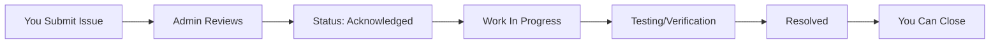

# 🚨 Issue Reporting

Found a problem on campus? Report it and get it resolved!

## What is Issue Reporting?

A **direct channel to campus administration** for reporting and tracking campus issues.

**Report:**
- 🚧 Infrastructure problems (broken lights, AC, doors)
- 🚽 Washroom issues
- 🌐 WiFi connectivity problems
- 🍽️ Cafeteria complaints
- 🅿️ Parking issues
- 🔒 Security concerns
- 📚 Library problems
- 💻 Lab equipment issues

## Why Use It?

### For Students 🎓

✅ **Get Issues Fixed** - Direct line to admin  
✅ **Track Progress** - See status updates  
✅ **Make Impact** - Improve campus for everyone  
✅ **Transparent** - Public visibility of issues  
✅ **Efficient** - No need to find the right person

### For Administration 👨‍💼

✅ **Centralized Reports** - All issues in one place  
✅ **Prioritize** - See which issues affect most students  
✅ **Track Resolution** - Monitor progress  
✅ **Student Feedback** - Direct communication channel

## How to Report an Issue

### Step-by-Step Guide

1. **Click "Report Issue"** button
2. **Choose Category**:
   - Infrastructure
   - WiFi/Internet
   - Cafeteria
   - Washrooms
   - Security
   - Library
   - Laboratory
   - Other
3. **Fill Details**:
   - **Title** - Short description (e.g., "Broken AC in Room 401")
   - **Description** - Full details of the problem
   - **Location** - Specific building/room
   - **Severity** - Low, Medium, High, Critical
   - **Photos** - Upload images (optional but helpful!)
4. **Submit** - Your report is sent to admin immediately

### What Happens Next?

**You'll receive notifications at each stage!**

## Issue Statuses

| Status | What It Means | What You Should Do |
|--------|---------------|-------------------|
| 🆕 **New** | Just submitted | Wait for admin review |
| 👀 **Acknowledged** | Admin saw it | Issue is confirmed |
| 🔧 **In Progress** | Being worked on | Check for updates |
| 🧪 **Testing** | Fix is being verified | Wait for completion |
| ✅ **Resolved** | Issue is fixed | Verify and close |
| ❌ **Rejected** | Not valid/duplicate | See admin comment |

## Writing Good Issue Reports

### ✅ Good Example

**Title:** Broken AC in CSE Lab (Room 401)

**Description:**
> The air conditioner in CSE Lab Room 401 has not been working since Monday, Feb 3. The room gets very hot during afternoon classes (2-5 PM), making it difficult to focus. Multiple students have complained. The AC remote shows an error code.

**Location:** CSE Building, 4th Floor, Room 401  
**Severity:** High  
**Photos:** [Image of AC showing error code]

### ❌ Poor Example

**Title:** AC not working

**Description:**
> Fix the AC

**Location:** CSE  
**Severity:** Low

### Why the First is Better:

✅ Specific location (room number)  
✅ When the problem started  
✅ How it affects students  
✅ Additional details (error code)  
✅ Photo evidence  
✅ Appropriate severity rating

## Issue Categories Explained

### 🏢 Infrastructure
- Broken furniture
- Damaged walls/floors
- Elevator problems
- Door/window issues
- Lighting problems
- HVAC (AC/heater) issues

### 🌐 WiFi/Internet
- No connectivity in specific areas
- Slow speeds
- Network drops
- Cannot authenticate

### 🍽️ Cafeteria
- Food quality issues
- Hygiene concerns
- Pricing problems
- Service complaints

### 🚽 Washrooms
- Cleanliness issues
- Broken fixtures
- No water/soap
- Maintenance needed

### 🔒 Security
- Safety concerns
- Suspicious activity
- Broken locks
- Lighting in dark areas

### 📚 Library
- Missing books
- Broken computers
- Noise issues
- Space problems

### 💻 Laboratory
- Broken equipment
- Software issues
- Missing supplies

## Tracking Your Issues

### My Issues Dashboard

View all your reported issues:
- **Status** of each report
- **Admin responses**
- **Timeline** of progress
- **Resolution details**

### Upvote Other Issues

See an issue that affects you too?
- **Upvote** to show it affects many students
- Higher upvotes = Higher priority for admin

## Priority Levels

### 🔴 Critical (24-hour response)
- Safety hazards
- No water/electricity in major areas
- Security breaches

### 🟠 High (2-3 days)
- AC/heating in classrooms
- WiFi down in large areas
- Major lab equipment broken

### 🟡 Medium (1 week)
- Furniture issues
- Minor maintenance
- Cafeteria complaints

### 🟢 Low (2+ weeks)
- Cosmetic issues
- Minor inconveniences
- Suggestions/improvements

## Real Impact Stories

**Farah - BBA Student 💼**
> "The study area lights were flickering for weeks. I reported it on EduSync with photos. Fixed within 3 days! Now I can study there again."

**Imran - CSE Major 🖥️**
> "Lab 502's computers had outdated software for our course project. Reported with High severity. Admin updated them in 2 days!"

**Meem - Architecture 🎨**
> "Washroom on 3rd floor had cleanliness issues. Multiple students upvoted my report. Admin increased cleaning frequency. Much better now!"

**Karim - EEE Student ⚡**
> "WiFi was terrible in the cafeteria area. 50+ students upvoted my report. IT team installed a new router within a week!"

## Tips for Effective Reporting

### 📸 Take Photos
Visual evidence helps admin understand the problem quickly.

### 📍 Be Specific
"Room 401, 4th Floor, CSE Building" is better than "CSE".

### ⏰ Mention Timing
If the issue occurs at specific times, mention it.

### 🤝 Check for Duplicates
Search if someone already reported it - upvote instead of duplicating.

### 📈 Choose Correct Severity
Be honest - don't mark everything as Critical.

### 💬 Respond to Admin
If admin asks for more details, respond promptly.

## Admin Communication

### Updates from Administration

Admins may:
- Ask for more information
- Provide updates on progress
- Share estimated resolution time
- Explain if issue cannot be fixed

### How to Respond

1. Check notifications regularly
2. Provide requested information promptly
3. Verify when issue is marked resolved
4. Close the issue if satisfied

## Community Impact

**Your reports make campus better for everyone!**

📊 **Statistics that matter:**
- Average resolution time: 5 days
- 85% of reported issues get resolved
- Most upvoted issue last month: "WiFi in Library" (234 upvotes)
- Fastest resolution: Broken door lock (4 hours)

---

**See a problem? Report it today! Together we make campus better. 🚀**
